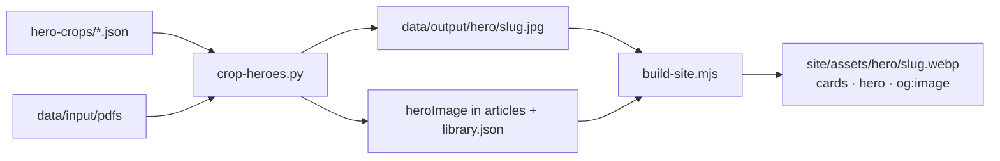

# proud.de Archive Workflow

This project turns original proud magazine PDFs into a public, agent-readable archive.

## Current Published State

- The live test site is `https://proud.xn--wp9h.tk`.
- The generated site currently publishes issue `01` as HTML, Markdown, JSON, `llms.txt`, API endpoints, and MCP/agent metadata.
- Original PDFs are public web assets through Cloudflare R2 and the Worker route `/assets/pdfs/...`.
- Original PDFs are not committed to GitHub. They are large source assets and stay in local storage and R2.

## Local Secrets

Secrets belong in `.env.local`.

Required local values can include:

- `OPENROUTER_API_KEY` for AI/OCR extraction and translation.
- `FAL_KEY` for future image workflows.
- `CLOUDFLARE_API_TOKEN` for deploys to the Cloudflare account that owns the proud test Worker.

`.env.local` is ignored by Git. Do not commit API tokens.

Deploy with the local token:

```bash
npm run cf:deploy:local
```

The token must have access to the Cloudflare account and zone used by `wrangler.jsonc`.

## Issue Rollout Plan

Process issues step by step, not all at once.

1. Ingest one new issue together with the already reviewed baseline issue.
2. Review article boundaries, titles, scans, text quality, Markdown, and language switch.
3. Translate the reviewed issue to English.
4. Build and deploy the test site.
5. Run the live audit before treating the result as published.

The target quality bar is high: if article grouping or OCR quality is visibly weak, do not publish that issue as final.

## Commands

Create a review input folder for issues `01` and `02`:

```bash
mkdir -p data/input/review-issues-01-02
ln -sf '../pdfs/01 proud issuu_output.pdf' 'data/input/review-issues-01-02/01 proud issuu_output.pdf'
ln -sf '../pdfs/02 proud issuu_output.pdf' 'data/input/review-issues-01-02/02 proud issuu_output.pdf'
```

Generate German extraction plus English translation for issue `02`:

```bash
npm run generate -- --input-dir data/input/review-issues-01-02 --translate en --magazine 02-proud-issuu-output
```

Deploy after review:

```bash
npm run cf:deploy:local
npm run audit:live -- https://proud.xn--wp9h.tk
```

## Hero Images

Cards, the article hero and `og:image`/`twitter:image` use a cropped cutout (photo, illustration or graphic) instead of the full page scan when one exists. The full page scans stay in the article's page gallery.

- Manifests: `data/input/hero-crops/*.json`. All files are merged in name order, and later files win. Format: `{ "<article-slug>": { "page": 12, "bbox": [x1, y1, x2, y2], "kind": "photo|illustration|graphic|none", "note": "..." } }`. `bbox` is in pixels of the 2235x2996 page image, and `page` is the 1-based PDF page.
- `python3 scripts/crop-heroes.py` writes `data/output/hero/<slug>.jpg` (q88, long edge ≤1800px) and sets `heroImage` in `data/output/articles/<slug>.json` and `library.json`. A bbox outside the page is skipped with a warning. The script is idempotent.
- `npm run build:site` optimizes `hero/` into `site/assets/hero/*.webp`. The image fallback is `heroImage` → `previewImage` → first page image.


