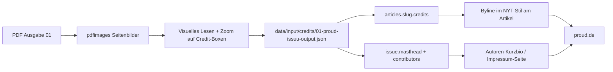

# Credits – Ausgabe 01 (proud, Januar 2009)

Quelle: `data/input/pdfs/01 proud issuu_output.pdf` (68 Seiten, Bilder 2235×2996 px), visuell gelesen, Credit-Boxen gezoomt.
Daten: `data/input/credits/01-proud-issuu-output.json`.

## Zahlen

- 63 Artikel, **18 mit gedrucktem Credit**, 45 ohne.
- Davon echte Personen-Bylines (Text/Foto/Layout): 10 Artikel. Der Rest sind Bildquellen (flickr.com, JanAdler.com, Domains) oder Plakat-/Produktions-Credits.
- Impressum: S. 6. Einzige Kurz-Bio: Moritz Stellmacher (S. 8, Inhaltsseite).

## Impressum (S. 6)

| Rolle | Namen |
|---|---|
| Publisher | Richard Kirschstein, Emin Henri Mahrt |
| Text Editor | Miron Tenenberg |
| Fashion Editor | Emilie Wong |
| Event Manager | Rico Kramer |
| Advertising Manager | Richard Kirschstein (proud@me.com), Emin Henri Mahrt, Kash Patton |
| Production | Richard Kirschstein, Emin Henri Mahrt |
| Cover | Jason Forster (www.salondepigeon.com) |
| Correction | K.-H. Kirschstein, Ariane Kirschstein, Jennifer Bendele |
| Special Thanks To | Frederik Eichelbaum |

Adresse: proud GbR, Manteuffelstraße 64, 10999 Berlin Kreuzberg, hq@proudmagazine.de.
Nicht gedruckt: ISSN, Auflage, Druckerei, V.i.S.d.P.
Dazu 15 „Regular Contributors“ und 26 „Contributors“ (Liste im JSON).

## Personen mit Artikel-Credits

| Name (wie gedruckt) | Label | Artikel |
|---|---|---|
| Moritz Stellmacher | Images, Text | 2 (launch at yaka paka, M und die Verantwortung…) |
| Lukas Kampfmann | Text | 1 (love in berlin) |
| Christian Rothenhagen | Layout | 1 (love in berlin) |
| Johnny Macchiato, Schnaps Magazine | GASTAUTOR | 1 (maximal my ass) |
| Fred Kreeger | Text | 1 (Vom Anfang bis zum…) |
| Uwe Krass | Text | 1 (Alte Legenden, neue Entdeckungen) |
| Pumpa Peta | Text | 1 (Wie überzeugt man…; Impressum: „Peta Pumpa“) |
| Ron WIlson / Tim / Cotumo | Text | 1 (proud DJ-Kolumnen, drei Spalten) |
| Jan Adler / JanAdler.com | image / Image | 4 (très bonjour ×2, Fashion Show 2008, wardrobe) |
| Maren Böttcher (www.MarenBoettcher.com), Katarzyna Konopka, Pola Kardum, Rouge Bunny Rouge | Image, Assistant, Fashion & Model, Make-Up | 1 (pola kardum x maren böttcher) |
| Kadir Memiş »Amigo«, Zula Lemes, Nevzat Akpinar, Yavuz Topuz »Risk One« | Choreografie, Beratung, Komposition, Mit | 1 (ZEY' BREAK, Plakat) |

Bildquellen ohne Person: flickr.com (kitlers, write to us and win, 200 calories), www.jannicahoney.com (superfertile.com).
Außerhalb der 63 Artikel: „By Ruby Kam“ (geared up, S. 41), „Image Moritz Stellmacher“ (last look, S. 65), „photography by moritz thau“ (Anzeige S. 7).

## Ohne Credit (45)

editorial, proud (Impressum), Leserbriefe (mail of the month, Flap..flap..flap.., Gut erkannt, Vorsicht vor irgendwas, New Uri Geller: nur Leser-Unterschriften), Ihr könnt alle kommen, phb berlin, shit glitter, world 2.1, artgerechtes, e-rags, mavi, oh!mi!bod, five minutes review on, fritz helder, schnaps magazine, ceza at ballhaus naunynstrasse, pentagonik, Kannibalistische Babarenvölker, Andere Richtungen, dj craft, proud (Zeichenbattle), berlin bedtime, farbreiz, Warum überhaupt diese ganze, hörvergnügen, Deinen Name sieht man überall…, jakob ellwanger, keller, 7days, end skater heroes, 6-rags, naketan, traktor scratch pro, lyndon wade, BLVD OF, on the road with a radio skater, tatsch, doktorspielchen, farbreiz (2), proud launch party, showroom, tal der verwirrung.

## Unsicher / nicht lesbar

- **zey-break** (low): senkrechte Kleinzeile „Gestaltung: … Berlin | Fotos: … | Druck: … Offset“ – Namen bei dieser Auflösung unlesbar.
- **proud-dj-kolumnen** (medium): „Ron WIlson“ mit großem I gedruckt; „Tim“ vs. „Tillman“ im Impressum.
- **lyndon-wade** (medium): Fotograf nur im Fließtext genannt, kein Credit-Label.
- **tr-s-bonjour-fashion-show-2008** (medium): Schreibweise „image Jan Adler“ (klein) nicht ganz sicher.

## Fluss in die Website

