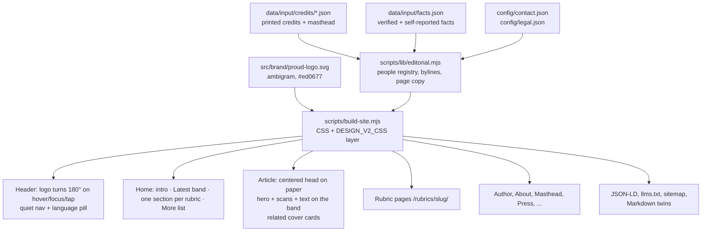

# Design system: proud magazine Berlin (archive edition)

Design v2 (October 2026). Model: the owner's own site (emin.de preview): warm paper, a quiet text-only top bar, generous whitespace, a narrow reading column, a centered article header and big cover cards in sections. The proud CI stays: the real pink ambigram logo, black label headings (Barlow bold, white on black), pink rubric kickers. Nothing dark, no newspaper furniture (no double rules, no letter-spaced caps nav, no boxed buttons).

## Tokens

| Token | Value | Use |
|---|---|---|
| `--bg` / `--paper` | `#fdf6e3` | Page (warm paper). Never dark. |
| `--band` | `#eee8d5` | Alt band: home "Latest", article body, related stories |
| `--ink` | `#073642` | Body text (12.0:1 on paper) |
| `--head` | `#002b36` | Card titles, nav, footer links |
| `--label-bg` | `#1a1713` | Black label headings (white text) |
| `--muted` | `#4f646b` | Kicker issue, datelines, captions (5.1:1 on band) |
| `--line` | `#e4dfcf` | Hairlines (footer, More list) |
| `--link` | `#1a669c` | Links, subtle underline (5.0:1 on band) |
| `--logo-pink` | `#ed0677` | Logo, focus ring, active nav underline, quote rule. Not for text (3.5:1). |
| `--proud-pink` | `#b8004f` | Rubric kicker, link hover, the word "proud" in text (5.4:1 on band) |
| `--radius` | `12px` | Images, cover cards, hero, scans |
| Label headings | Barlow 700, `--size-label-title` clamp(2.2rem, 5.5vw, 3.6rem), `--size-label-h2` clamp(1.6rem, 3vw, 2.1rem) | Page titles (H1), section heads, question headings in articles |
| Card titles | Barlow 700, plain `--head` colour | Cover cards (no label box) |
| Body | Inter, `--size-body` 21.6–24px | Reading text. Do not shrink. |
| Meta | 17–18px | Minimum text size on the site (17px floor) |

Black label heading: `<h1 class="label-title">…</h1>`. The span is `display:inline` with `box-decoration-break: clone`, so every wrapped line gets its own black box. Article body H2/H3 and prose H2 get the span via `labelHeadings()`.

## Logo

- File: `src/brand/proud-logo.svg`, one path, fill `#ed0677`, viewBox cropped to the glyphs (`116 184 2330 1073`), `<title>proud</title>`, `role="img"`. Built copies: `/assets/proud-logo.svg` (SVG favicon), `/assets/logo.png` (512×512 transparent, padded square; apple-touch-icon), `/assets/logo-1200.png` (1200×553, schema.org `logo`), `/favicon.ico` (16/32/48).
- Inline in header (116px wide, 84px under 760px) and footer (92px), inside the home link `aria-label="proud magazine Berlin home"` (`… Startseite` in German). The inline SVG is `aria-hidden` because the link carries the name.
- It is an ambigram: rotated 180° it still reads "proud". Hover, keyboard focus and tap (`:hover`, `:focus`, `:active`) turn it 180° with `transform 0.6s cubic-bezier(.65,0,.35,1)`. With `prefers-reduced-motion: reduce` there is no transition and no rotation. Focus ring: 3px `--logo-pink`.
- Never recolour, outline, stretch or put it on a dark ground. Minimum width 84px. No GIF: the rotation is CSS (no Drive animation was clearly better than the vector).

Rules: no autoplay motion (the logo turn is user-triggered only), no particles, no jargon. Tap targets ≥ 44px. No horizontal scroll at 360 and 390 px.

## Page templates

| Template | Order |
|---|---|
| Header (all pages) | Logo (left) · text nav Artikel, Ausgaben, Autor:innen, Über proud, Redaktion (right; second row under 760px, wraps, never clipped) · language pill |
| Home | Centered intro (kicker, label H1, one sentence + About link) · band "Neu im Archiv / Latest" (lead cover card wide + 5 cover cards, "All articles") · one section per rubric with ≥2 unshown stories (label heading, 3 cover cards, "Mehr <Rubrik>") · "More" list · "All N articles" |
| Cover card | 3:2 cutout (rounded) · kicker (pink rubric + issue) · plain bold title · 3-line deck · printed author or photo credit + month |
| Article | Centered head on paper: kicker (rubric link + `proud #01 · Januar 2009`) · label H1 · "Kurz gesagt:/In short:" + italic deck · byline `Von …` + secondary credits · dateline · pills (Originalseite, Markdown, Deutsch/English) · printed bio note if any. Then on the band: hero with caption + printed photo credit · scans · text (label question headings) · author box · videos. Then related stories as cover cards. |
| Rubric `/rubrics/<slug>/` (de + en) | Kicker · label H1 (rubric as printed, capitalised) · deck · all cover cards of the rubric · All articles. Markdown twin, sitemap with hreflang, llms.txt "Rubrics". |
| Author | Kicker · label H1 name as printed · roles · printed bio (only Moritz Stellmacher has one) · masthead roles · article list · source note |
| Text page | Kicker · label H1 · deck · prose from `staticPageMarkdown()` with label H2s |
| Footer | Logo · About, Masthead, Standards, Press, Archive guide, Corrections (+ Impressum, Datenschutz when configured) · "Herausgeber heute" · DNB trust line |

Images: hero cutouts ship as 1600px plus 800px (`/assets/hero-800/`), scans as 1400px plus 760px (`/assets/page-images-760/`), offered via `srcset`/`sizes`; all immutable-cached.

## Honesty rules (enforced in `tests/editorial.test.mjs` and `scripts/audit-live.mjs`)

- Bylines only from printed credits. No credit means no "Von" line. Low-confidence credits (`zey-break`) never create author pages.
- Image sources (flickr.com, JanAdler.com, domains, brands) are credits, not people.
- No invented bios, photos, titles or social links. Names as printed; alias noted (`Pumpa Peta` / `Peta Pumpa`, `Ron WIlson` / `Ron Wilson`).
- Publisher: "Herausgeber heute: Emin Mahrt" (owner statement 06.10.2026, private person). Issue 01 (2009): "Herausgeber laut Impressum Richard Kirschstein und Emin Henri Mahrt". Never "sole publisher in 2009". No company as current operator.
- DFJV: only the verified 2009 newsletter quote (About, Press), as blockquote + cite, no link (no public copy). Never "recognised", "awarded", "mentioned multiple times".
- Never: 1.5 million, 650,000, awards, ISSN (none exists), founding year as fact (say "first issue January 2009", dummy #00 2008).
- Print run 20,000 only with "nach Angaben der Herausgeber" / "according to the publishers".
- Contact and legal data only from `config/contact.json` and `config/legal.json`. Empty means not shown.
