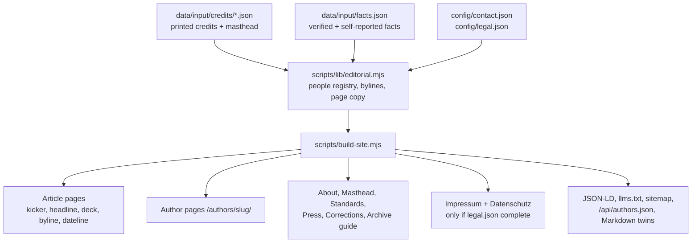

# Design system: proud magazine Berlin (archive edition)

The NYT article page is the model. The site is bright, quiet and serious. A little proud CI: the pink lower-case wordmark `proud.`, pink rubric kickers and the black label tag.

## Tokens

| Token | Value | Use |
|---|---|---|
| `--bg` / `--paper` | `#ffffff` | Page. Never dark. |
| `--ink` | `#181411` | Text, rules, black label tag |
| `--muted` | `#6f6a61` | Datelines, captions, meta |
| `--line` | `#e4e0d8` | Hairline rules |
| `--proud-pink` | `#d0005f` | Wordmark, rubric kicker, active nav, focus ring |
| Headings | Barlow 600/700 (800 synthesized for question headings) | Headline, section labels |
| Body | Inter, `--size-body` 21.6–24px | Reading text. Do not shrink. |
| Meta | `--size-meta` 17.6px | Minimum text size on the site (17px floor) |

Rules: no animation, no particles, no jargon. Tap targets ≥ 44px. No horizontal scroll at 360 and 390 px.

## Page templates

| Template | Order |
|---|---|
| Header (all pages) | Strip "Archiv-Ausgabe: Berlin 2009–2014" + language link · wordmark `proud.` · section nav (Artikel, Ausgaben, Autor:innen, Über proud, Redaktion) · double rule |
| Article | Kicker (black tag `proud #01 · Januar 2009` + pink rubric) · H1 headline · deck (one sentence) · byline `Von …` + secondary credits (`Layout: …`) · dateline `Berlin · Januar 2009 · Heft 01, Seiten 22–23 · 3 Min. Lesezeit` · small author note · action bar (Originalseite, Markdown, Deutsch/English) · hero with caption + printed photo credit · scans · text · author box · related stories |
| Home | Lead story (cutout, kicker, headline, deck, byline) · 3-column story grid · issues strip (cover only if an asset exists) |
| Author | Kicker · name as printed · roles · printed bio (only Moritz Stellmacher has one) · masthead roles · article list · source note |
| Text page | Kicker · H1 · deck · prose from `staticPageMarkdown()` (same text as the Markdown twin) |
| Footer | Wordmark · About, Masthead, Standards, Press, Archive guide, Corrections (+ Impressum, Datenschutz when configured) · "Herausgeber heute" · DNB trust line |

## Honesty rules (enforced in `tests/editorial.test.mjs` and `scripts/audit-live.mjs`)

- Bylines only from printed credits. No credit means no "Von" line. Low-confidence credits (`zey-break`) never create author pages.
- Image sources (flickr.com, JanAdler.com, domains, brands) are credits, not people.
- No invented bios, photos, titles or social links. Names as printed; alias noted (`Pumpa Peta` / `Peta Pumpa`, `Ron WIlson` / `Ron Wilson`).
- Publisher: "Herausgeber heute: Emin Mahrt" (owner statement 06.10.2026, private person). Issue 01 (2009): "Herausgeber laut Impressum Richard Kirschstein und Emin Henri Mahrt". Never "sole publisher in 2009". No company as current operator.
- DFJV: only the verified 2009 newsletter quote (About, Press), as blockquote + cite, no link (no public copy). Never "recognised", "awarded", "mentioned multiple times".
- Never: 1.5 million, 650,000, awards, ISSN (none exists), founding year as fact (say "first issue January 2009", dummy #00 2008).
- Print run 20,000 only with "nach Angaben der Herausgeber" / "according to the publishers".
- Contact and legal data only from `config/contact.json` and `config/legal.json`. Empty means not shown.
