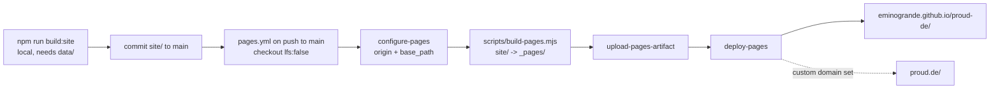

# GitHub Pages

The committed static export in `site/` gets published to
https://eminogrande.github.io/proud-de/ by `.github/workflows/pages.yml`.
CI doesn't rebuild anything and doesn't download Git LFS objects.

Prerequisite (one time, already done for this repo): set Pages to publish
from Actions, either via Settings → Pages → Build and deployment → Source →
**GitHub Actions** or with
`gh api -X POST repos/eminogrande/proud-de/pages -f build_type=workflow`.
`configure-pages` does not enable Pages by itself.

## What build-pages.mjs does

`site/` is built for the Cloudflare host `https://proud.xn--wp9h.tk` and uses
root-absolute links such as `/articles/x/`. A Project Pages site is served
under `/proud-de/`, so the script copies `site/` into `_pages/` and changes
the following:

- It rewrites `https://proud.xn--wp9h.tk` (and the bare host) to `PAGES_ORIGIN + PAGES_BASE_PATH`. This covers canonical, hreflang, OpenGraph, JSON-LD, sitemap, robots, llms.txt and `.well-known/*`.
- It prefixes root-absolute `href`/`src`/`srcset`/`action` in HTML, `](/` in Markdown and `url(/` in CSS with the base path.
- It adds `<lastmod>` to the sitemap, using the date of the last commit that touched `site/`.
- It removes the worker-only `.well-known/oauth-*` and `http-message-signatures-directory` entries from the sitemap, because Pages can't serve them.
- It drops the Cloudflare-only `_headers` file and adds `.nojekyll`. Without `.nojekyll`, Pages skips `.well-known/`.

`actions/configure-pages` supplies the origin and base path. Today they are
`https://eminogrande.github.io` and `/proud-de`.

## Switching to proud.de

1. DNS: point `proud.de` to the GitHub Pages IPs (A records 185.199.108-111.153). Point `www` with a CNAME to `eminogrande.github.io`.
2. Run `gh api -X PUT repos/eminogrande/proud-de/pages -f cname=proud.de`, then turn on HTTPS in Settings → Pages.
3. Re-run the workflow (`gh workflow run pages.yml`). configure-pages then reports `https://proud.de` with an empty base path. All links become root-absolute again and canonicals point to proud.de.

To preview the output locally:
`PAGES_ORIGIN=https://eminogrande.github.io PAGES_BASE_PATH=/proud-de node scripts/build-pages.mjs site _pages`

## Limits of GitHub Pages

Pages only serves static files. It ignores everything that runs in
`cloudflare/worker.mjs` and also ignores `site/_headers`:

| Feature | On Pages | Fix |
|---|---|---|
| `/mcp` remote MCP server | 404 | Keep the Cloudflare worker on a subdomain (e.g. `mcp.proud.de`) and point server-card/mcp.json at it |
| `/api/search?q=` | 404 | Use the static `api/search-index.json` client-side, or route via the worker subdomain |
| `/oauth/token` | 404 | Worker subdomain only |
| `Accept: text/markdown` negotiation | serves HTML | Agents should use `<link rel=alternate type=text/markdown>` → `index.md` (present) |
| `Link:` response headers, `X-Robots-Tag` | not sent | Same links exist in HTML `<link>` tags; put Cloudflare proxy in front of Pages if required |
| Custom content types for extensionless `.well-known/*` files and `.md` | served as `application/octet-stream` / `text/markdown` defaults | Cloudflare proxy, or accept the defaults |
