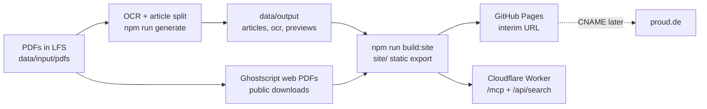

# Handoff: republish all proud magazine issues

Owner: Emin Mahrt, publisher of proud today (private person, operates this archive; owner statement 06.10.2026). Issue 01 (2009) masthead: Richard Kirschstein and Emin Henri Mahrt. Print run: monthly 2009-2014, final issue #32 (DNB).
Goal: every article of every issue live, agent-ready, indexed by Google and ChatGPT. Later: custom domain `proud.de`, then new content (videos, interviews, YouTube).



## State on 2026-10-06 (verify before trusting)

| Item | State |
|---|---|
| Repo | `github.com/eminogrande/proud-de`, PUBLIC, branch `main` |
| PDFs | 34 files in `data/input/pdfs/`, tracked by Git LFS (`.gitattributes`) |
| Issues present | 00-09 and 11-32 (32 issues). **Issue 10 does not exist anywhere** (not local, not Drive, not Issuu). Owner thinks it was skipped. Do not hunt further. |
| Issue 15 | Was missing. Rebuilt from Issuu page images (`image.isu.pub/120727154624-4a4c782888404f5b9d38e0c491bdca5f/jpg/page_N.jpg`, 68 pages) into `15 proud issuu_output.pdf`. Image only, no text layer. |
| Extras | `22-proud-magazine-2011.pdf` (second file for issue 22, different), `abend_01.pdf` (not an issue). |
| Published so far | Only issue 01 (`site/magazines/01-proud-issuu-output`, ~65 article folders in `site/articles`). |
| Issue 02 | `docs/ISSUE_02_STATUS.md`: OpenRouter OCR failed with 402. Local Tesseract fallback gave 23 broken articles. Do not publish the fallback. |
| OpenRouter | Balance negative (used 256.05 vs 236 credits). **Needs a new key or top-up from the owner before the OCR run.** Never commit keys. `.env.local` is gitignored. |
| GitHub Pages | LIVE: https://eminogrande.github.io/proud-de/ (PR #1 7d8cfe5, PR #2 86790cb merged). Workflow `.github/workflows/pages.yml` copies committed `site/` via `scripts/build-pages.mjs` (no rebuild, no LFS). **New articles must be built into `site/` and committed; then Pages redeploys.** Details and audit: `docs/GITHUB_PAGES.md`. Static limits: no `/mcp`, `/api/search`, `Accept: text/markdown` (needs Cloudflare worker). |
| Editorial redesign | NYT-style article pages (kicker, headline, deck, printed byline, dateline, author note/box), `/authors/<slug>/` (20 people from printed credits + masthead), About, Masthead, Standards, Press, Corrections, Archive guide (de + en + Markdown twins). Design + honesty rules: `docs/DESIGN_SYSTEM.md`. Data: `scripts/lib/editorial.mjs`. |
| Owner inputs open | `config/legal.json` (Impressum/Datenschutz hidden until filled: operatorName, responsibleEditor, street, postalCode, city, email), `config/contact.json` (press/corrections email), author bios, confirmation of issue dates (`data/input/issue-dates.json` `_confirmed: false`). |
| Drive source | rclone remote `proud-gdrive:proud` (`scripts/sync-drive.mjs`). Same 31 issues, no 10, no 15. |

## Rules from the owner

- Code truth only. Cite file:line. Verify before claiming.
- Never redact or shorten output (URLs, hashes, ids in full).
- No spending without owner OK (OCR credits included).
- Every `.md` has a mermaid diagram. Short sentences. No text walls.
- Ready PRs, not drafts. Push is not deploy. Deploy needs SHA + rollback + proof.
- Public repo: never commit secrets, `.env*`, tokens.
- LFS: clone with `GIT_LFS_SKIP_SMUDGE=1`, then `git lfs pull --include="data/input/pdfs/NN*"` only what you need. Free LFS bandwidth is limited (about 10 GB/month, unverified).

## Tasks in order

1. Confirm the live Pages URL still returns 200 (`curl -I https://eminogrande.github.io/proud-de/`). Pages PRs are already merged.
2. Get an OpenRouter key with credits from the owner. Measure cost on one issue first (`02`), report cost per page, then run all. Config is in `README.md` (env: `OPENROUTER_API_KEY`, `PROUD_OCR_PROVIDER=openrouter-page`, `PROUD_OCR_OPENROUTER_MODEL=google/gemini-2.5-flash`, `PROUD_OCR_OPENROUTER_PDF_ENGINE=mistral-ocr`).
3. Per issue: `npm run generate -- --input-dir data/input/pdfs --magazine <NN-proud-issuu-output>`. Review title and segmentation quality before publishing (issue 02 failed this). Commit output per issue as its own PR.
4. Add `--translate en` once German extraction is clean.
5. Web PDFs: `gs -sDEVICE=pdfwrite -dPDFSETTINGS=/ebook -dNOPAUSE -dBATCH -sOutputFile=web/NN.pdf data/input/pdfs/NN*.pdf`. Untested. Check size and legibility on issue 02 first. Originals stay in LFS. Do not put web PDFs through Pages if the site passes 1 GB; use a GitHub Release or R2.
6. Run `npm run audit:live -- <live url>`; also isitagentready.com and PageSpeed. Fix cheap failures.
7. Cloudflare deploy (`docs/DEPLOY_CHECKLIST.md`) for `/mcp` and `/api/search`, which Pages cannot serve.
8. Before `proud.de` goes live: `proud.de` currently answers 302 to somewhere (not checked). Owner points DNS later. Add `CNAME` file and set `PROUD_PUBLIC_DOMAIN`.

## Paste this prompt into the cloud agent

```text
You continue work in https://github.com/eminogrande/proud-de (public). Read docs/HANDOFF.md first and follow it.
Goal: OCR and publish every article of all 32 proud magazine issues (00-09, 11-32; issue 10 does not exist), agent-ready, hosted on GitHub Pages, so Google and ChatGPT index it. Domain proud.de comes later.
Clone with GIT_LFS_SKIP_SMUDGE=1 and pull only the PDFs you need. Do not commit secrets. Ask the owner for an OpenRouter key before the OCR run and report cost per page after a one-issue test. One PR per issue, ready not draft. Verify every claim in code or live output; never invent results. Report: live URL, PR URLs, merge SHAs, issues done.
```
