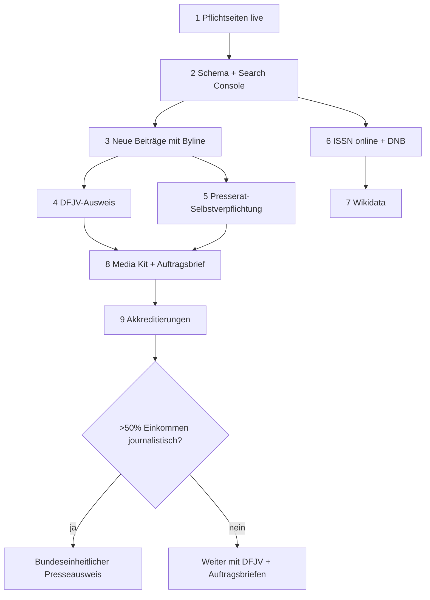

# proud – Press Checklist

Stand 06.10.2026. Quellen und Details: [`docs/PRESS_PLAYBOOK.md`](PRESS_PLAYBOOK.md).
🤖 = Agenten-Team allein · 🧑 = Emin persönlich (Unterschrift, Ausweis, Zahlung, Login)

## 1 · Pflichtseiten (Tag 1–7)

- [ ] 🤖🧑 `/impressum/` – § 5 DDG: Anbieter ist die **natürliche Person Emin Mahrt** (keine GmbH, kein HRB): Name, Anschrift, E-Mail, Telefon/Kontakt, USt-ID nur falls vorhanden. Daten in `config/legal.json`
- [ ] 🤖🧑 `/impressum/` – § 18 Abs. 2 MStV: Verantwortliche/r mit Name + Anschrift (Wohnsitz Inland)
- [ ] 🤖 `/datenschutz/` – Hoster, Server-Logs, Kontakt, YouTube 2-Klick
- [ ] 🤖 Cookie-Check: keine nicht-notwendigen Cookies → kein Banner nötig (§ 25 TDDDG)
- [ ] 🤖🧑 `/ueber/` – Geschichte 2008–2014, ~32 Ausgaben, Neustart
- [ ] 🤖🧑 `/redaktion/` – „Herausgeber heute: Emin Mahrt“ (allein, Privatperson) + historisches Impressum Heft 01 mit beiden Herausgebern wie gedruckt; Autorenprofile
- [ ] 🤖🧑 `/grundsaetze/` – Pressekodex, Trennung Werbung, KI-Hinweis (OCR/Übersetzung)
- [ ] 🤖 `/korrekturen/` – Prozess + Liste; Korrektur am Originalartikel (Pressekodex RL 3.1)
- [ ] 🤖 `/rechte/` – Credits, Widerspruch, Takedown binnen 72 h
- [ ] 🤖 `/archiv/` – Herkunft, OCR/KI, Zitierweise, Permalinks
- [ ] 🤖 `/kontakt/` – `redaktion@`, `presse@`, Media Kit
- [ ] 🧑 Mailadressen `redaktion@proud.de`, `presse@proud.de` anlegen
- [ ] 🤖 Footer: Links auf Impressum, Datenschutz, Grundsätze, Korrekturen, ISSN

## 2 · Technik & Suche (Tag 1–14)

- [ ] 🤖 JSON-LD: `publishingPrinciples`, `ethicsPolicy`, `correctionsPolicy`, `masthead`, `actionableFeedbackPolicy`, `founder`, `foundingDate`, `issn`, `sameAs`
- [ ] 🤖 Artikel: `datePublished`, `author` (Person-Link), sichtbare Byline + Datum
- [ ] 🤖 Autorenseiten mit `ProfilePage` + `Person`
- [ ] 🧑 Domain proud.de live, Testdomain → 301 auf proud.de
- [ ] 🧑 Google Search Console verifizieren, `sitemap.xml` einreichen
- [ ] 🧑 Bing Webmaster: Import aus Search Console
- [ ] 🤖 `robots.txt` prüfen: OAI-SearchBot, Claude-SearchBot, PerplexityBot erlaubt ✅ (bereits so)
- [ ] 🤖 CDN/WAF blockiert diese Bots nicht (Logs prüfen)
- [ ] 🤖 Wayback „Save Page Now“: Start, Ausgaben, Pflichtseiten

## 3 · Inhalte als Beweis (ab Tag 7, laufend)

- [ ] 🧑 Mind. 2 neue Interviews/Artikel mit voller Byline + Datum
- [ ] 🧑 Fester Rhythmus festlegen und veröffentlichen (z. B. 2×/Woche)
- [ ] 🧑 YouTube-Kanal mit Link auf proud.de; im Schema als `sameAs`
- [ ] 🤖 Reichweite messen (Server-Logs / cookielose Analyse), monatlich festhalten

## 4 · Presseausweis (Tag 8–30)

- [ ] 🧑 DFJV-Mitgliedschaft (95 € Lastschrift / 100 € Überweisung pro Jahr)
  - [ ] Passfoto JPG
  - [ ] Nachweis: Impressum-Nennung als Redakteur + Artikel-URLs der letzten 6 Monate
- [ ] 🧑 Prüfen: > 50 % Einkommen journalistisch? Nur dann bundeseinheitlicher Ausweis
  - [ ] DJV Berlin – JVBB, Nichtmitglied 80 € (Eil +50 €; Ablehnung: 50 € Gebühr)
  - [ ] Steuerbescheid Vorjahr, Veröffentlichungen 3–6 Monate, Honorarabrechnungen 6 Monate

## 5 · Presserat (Tag 30–60)

- [ ] 🧑 Erst Rhythmus nachweisen (regelmäßiges Erscheinen)
- [ ] 🧑 Selbstverpflichtungserklärung unterschreiben (info@presserat.de)
- [ ] 🧑 Finanzierungserklärung: 100 €/Jahr (bis 0,5 Mio. Visits/Monat)
- [ ] 🤖 Hinweis „Wir achten den Pressekodex“ in Impressum + Grundsätzen

## 6 · ISSN & Bibliothek (Tag 7–30)

- [ ] 🤖🧑 Mail an issn@dnb.de: Online-ISSN, aktive Haupt-URL angeben (kostenlos)
- [ ] 🤖 Print-ISSN (falls vorhanden) recherchieren → siehe `docs/RESEARCH_PROUD.md`
- [ ] 🧑 DNB-Konto anlegen, Freischaltung „Ablieferung von Netzpublikationen“ (`portal.dnb.de/npdelivery`)
- [ ] 🤖🧑 DNB Service Netzpublikationen (+49 341 2271-282): Ablieferung als E-Journal klären
- [ ] 🤖 ZDB-Einträge prüfen (Print-Bestände in Bibliotheken → Wikipedia-Relevanz)
- [ ] 🤖 ISSN in Footer, Impressum, Schema eintragen

## 7 · Wikidata & Wikipedia (Tag 30–90)

- [ ] 🤖 Wikidata-Item „proud (Zeitschrift)“ mit DNB/ZDB-Quellen; Bearbeiter offen deklarieren
- [ ] 🤖 Wikidata-Item Emin Mahrt nur mit unabhängigen Quellen
- [ ] 🧑 Wikipedia: **nicht selbst schreiben**; unabhängige Autor:innen ansprechen; Quellen auf Diskussionsseite liefern
- [ ] 🧑 Knowledge Panel claimen, sobald eines erscheint (Login via YouTube/Search Console)

## 8 · Urheberrecht Archiv (Tag 8–60)

- [ ] 🤖 Rechte-Inventar: Artikel × Autor × Fotograf × Model × Vertrag
- [ ] 🤖 Mailentwurf an Beitragende (Info + Widerspruchsmöglichkeit)
- [ ] 🧑 Mails versenden, Antworten archivieren
- [ ] 🤖 Takedown-Log führen (Datum, Anfrage, Entscheidung)
- [ ] 🧑 Optional: 1 h Medienanwalt (Schätzung 150–400 €)

## 9 · Akkreditierungsmappe (ab Tag 30)

- [ ] 🤖 Auftragsbrief-Vorlage (Chefredaktion → Reporter)
- [ ] 🤖 Media Kit 1 Seite (Reichweite mit Datum + Methode)
- [ ] 🧑 2–3 aktuelle Clips mit Byline
- [ ] 🧑 Fristen eintragen: Berlinale (2026: 8.1., 70 €), re:publica (2026: 14.5.), Lollapalooza (2026: 15.6.)
- [ ] 🧑 Fashion Week: pro Label anfragen (keine zentrale Akkreditierung)
- [ ] 🧑 Fusion: keine Presseakkreditierung – nicht anfragen
- [ ] 🧑 Nach jedem Event: Belege an Pressestelle senden
