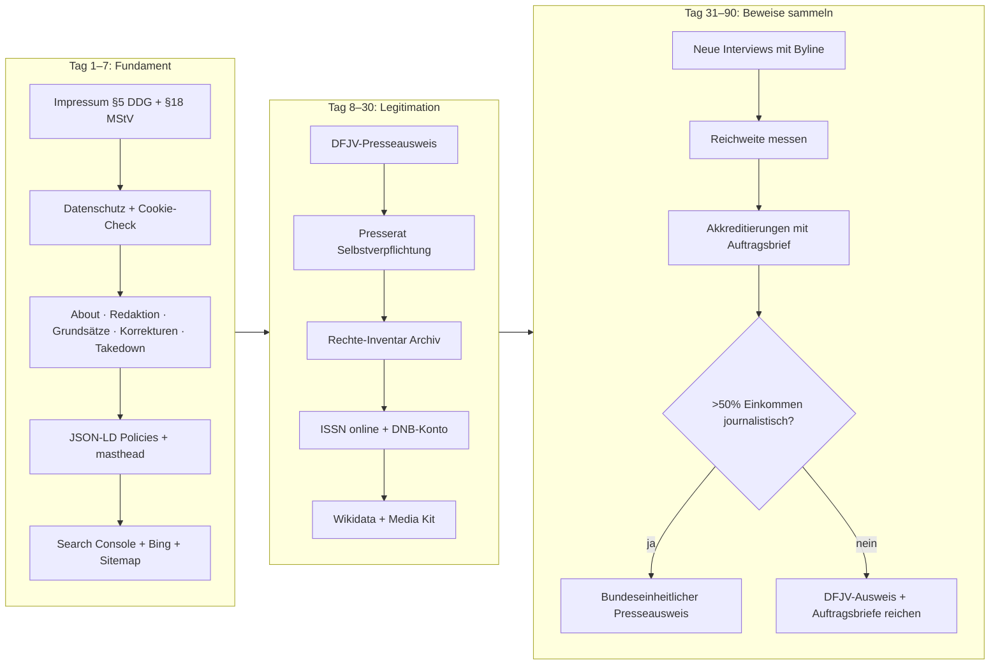
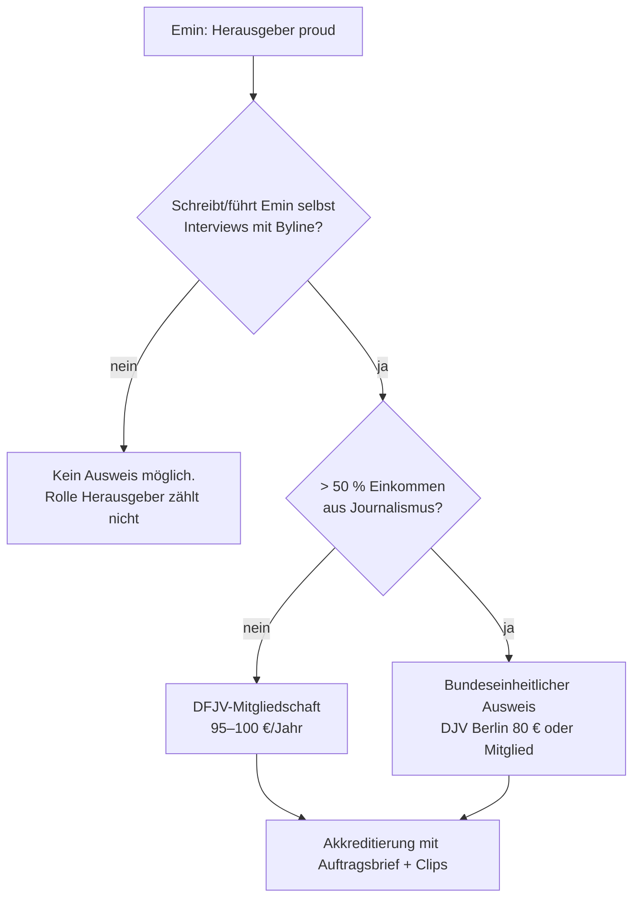

# proud – Press Playbook

Stand: **6. Oktober 2026**. Alle Quellen am 06.10.2026 abgerufen.
`UNVERIFIED` heißt: Diese Angabe konnte ich nicht an einer Primärquelle prüfen.
Das ist keine Rechtsberatung. Bei Urheberrecht und Impressum lohnt sich eine kurze Prüfung durch einen Medienanwalt.

---

## 1. Auf einen Blick

| Frage | Kurze Antwort |
|---|---|
| Bekommt Emin jetzt den **bundeseinheitlichen Presseausweis**? | **Eher nein.** Nur, wenn mehr als 50 % des Lebensunterhalts aus journalistischer Arbeit kommen. Die Rolle „Verleger/Herausgeber“ allein zählt ausdrücklich nicht. ([MVFP-Merkblatt 2026/27](https://www.mvfp.de/fileadmin/vdz/upload/services/Downloads/presseausweis/2026_2027_MerkblattDeutscherPresserat.pdf)) |
| Was geht sofort? | **DFJV-Presseausweis** über eine Mitgliedschaft, 95–100 €/Jahr. Nicht bundeseinheitlich, aber anerkannt bei vielen Messen. ([DFJV](https://www.dfjv.de/mitglied-werden)) |
| Was entscheidet bei Akkreditierungen wirklich? | **Arbeitsnachweise**: Auftragsbrief der Redaktion + aktuelle Veröffentlichungen. Die Berlinale schreibt: Presseausweis oder Impressum **ersetzen** die Nachweise **nicht**. ([Berlinale](https://www.berlinale.de/de/presse/presseakkreditierung/info.html)) |
| Größter rechtlicher Hebel | Impressum mit **verantwortlicher Person nach § 18 Abs. 2 MStV** – gilt genau für Seiten, die Inhalte periodischer Druckwerke wiedergeben. Das ist proud. ([MStV, Medienanstalten-PDF](https://www.die-medienanstalten.de/fileadmin/user_upload/Rechtsgrundlagen/Gesetze_Staatsvertraege/Medienstaatsvertrag_MStV.pdf)) |
| Größtes Vertrauenssignal | **Selbstverpflichtung beim Deutschen Presserat**. Für Onlinemedien bis 0,5 Mio. Visits/Monat: **100 €/Jahr**. Bringt zusätzlich das datenschutzrechtliche Medienprivileg. ([Presserat](https://www.presserat.de/selbstverpflichtung-onlinemedien.html)) |
| ISSN | **Kostenlos** beim ISSN-Zentrum der DNB. Für die Online-Ausgabe gibt es eine **eigene** ISSN; Antrag erst, wenn die Seite live ist. ([DNB ISSN](https://dnb.de/EN/Professionell/Services/ISSN/issn.html)) |
| Wikipedia | Eingestellte Zeitschriften gelten als relevant, wenn sie in mehreren Bibliotheken nachgewiesen sind (**ZDB**: 5 Standorte in mind. 2 Verbünden). Emin darf den Artikel **nicht selbst** schreiben. ([WP:RK](https://de.wikipedia.org/wiki/Wikipedia:Relevanzkriterien), [WP:COI](https://en.wikipedia.org/wiki/Wikipedia:Conflict_of_interest)) |
| Google News | Keine Anmeldung mehr. Google erkennt Nachrichtenseiten automatisch. Pflicht: Datum, Byline, Autoren-Info, Verlags-Info, Kontakt. ([Google News Policies](https://support.google.com/news/publisher-center/answer/6204050?hl=en), [Google News Surfaces](https://support.google.com/news/publisher-center/answer/9607025?hl=en)) |
| KI-Suche | `robots.txt` erlaubt schon OAI-SearchBot, Claude-SearchBot, PerplexityBot. Passt. ([OpenAI](https://platform.openai.com/docs/bots), [Anthropic](https://support.claude.com/en/articles/8896518-does-anthropic-crawl-data-from-the-web-and-how-can-site-owners-block-the-crawler), [Perplexity](https://docs.perplexity.ai/guides/bots)) |

**Ist-Zustand der Seite** (im Repo geprüft am 06.10.2026):
`site/` hat **kein** Impressum, **keine** Datenschutzerklärung, **keine** About-/Redaktionsseite.
Die JSON-LD auf `site/index.html` enthält `NewsMediaOrganization`, aber ohne `publishingPrinciples`, `correctionsPolicy`, `masthead`, `founder`. `sameAs` zeigt nur auf GitHub. Die URL ist noch die Testdomain `proud.xn--wp9h.tk`.
→ **Vor jeder Akkreditierung: die Pflichtseiten aus Abschnitt 8 live stellen.**

---

## 2. Roadmap 7 / 30 / 90 Tage

Legende: 🤖 = Agenten-Team kann das allein · 🧑 = Emin persönlich (Unterschrift, Ausweis, Zahlung, Login)

### Nächste 7 Tage

| # | Schritt | Wer | Aufwand | Kosten |
|---|---|---|---|---|
| 1 | Impressum-Entwurf (§ 5 DDG + § 18 Abs. 2 MStV) als Seite bauen | 🤖 Entwurf · 🧑 Daten prüfen | 2 h | 0 € |
| 2 | Datenschutzerklärung; prüfen, ob die Seite Cookies/Tracking setzt (§ 25 TDDDG) | 🤖 | 2 h | 0 € |
| 3 | Seiten **Über proud**, **Redaktion**, **Redaktionelle Grundsätze**, **Korrekturen**, **Urheberrecht & Takedown**, **Presse/Kontakt** | 🤖 Entwurf · 🧑 Freigabe | 6 h | 0 € |
| 4 | JSON-LD erweitern: `publishingPrinciples`, `correctionsPolicy`, `ethicsPolicy`, `masthead`, `founder`, `actionableFeedbackPolicy` | 🤖 | 1 h | 0 € |
| 5 | E-Mail-Adresse `redaktion@` / `presse@proud.de` einrichten | 🧑 (Domain-Login) | 0,5 h | 0 € (beim Hoster) |
| 6 | Google Search Console + Sitemap; Bing per Import aus GSC | 🧑 Login · 🤖 Anleitung | 1 h | 0 € |
| 7 | Mail an `issn@dnb.de`: Online-ISSN für proud anfragen (sobald proud.de live ist) | 🤖 Entwurf · 🧑 senden | 0,5 h | 0 € |

### Nächste 30 Tage

| # | Schritt | Wer | Aufwand | Kosten |
|---|---|---|---|---|
| 8 | **DFJV-Mitgliedschaft** + Presseausweis beantragen (Nachweis: Impressum-Nennung + Artikel mit URL) | 🧑 Antrag, Foto, Zahlung | 1 h | 95–100 €/Jahr |
| 9 | **Presserat**: Selbstverpflichtungserklärung unterschreiben, danach Finanzierungserklärung | 🧑 Unterschrift | 1 h | 100 €/Jahr |
| 10 | **Rechte-Inventar** Archiv: Wer schrieb, wer fotografierte, wer modelte? Verträge suchen. Mails an Beitragende. | 🤖 Liste + Mailentwurf · 🧑 Absender | 8–15 h | 0 € |
| 11 | Erste **neue** Veröffentlichungen: 2–4 Interviews mit voller Byline und Datum | 🧑 + Team | laufend | – |
| 12 | **Media Kit** v1 (Abschnitt 6) + Muster-Auftragsbrief | 🤖 | 3 h | 0 € |
| 13 | DNB: Konto auf `portal.dnb.de/npdelivery` anlegen, Freischaltung „Ablieferung von Netzpublikationen“ beantragen; mit Service Netzpublikationen klären, ob proud als E-Journal abgeliefert wird | 🧑 Registrierung · 🤖 Anfrage | 2 h | 0 € |
| 14 | Wikidata-Item für **proud (Zeitschrift)** anlegen – mit DNB/ZDB-Belegen | 🤖 möglich, besser 🧑 offen deklariert | 2 h | 0 € |
| 15 | Wayback „Save Page Now“ für Startseite, Ausgaben- und Pflichtseiten | 🤖 | 0,5 h | 0 € |
| 16 | Beratung **DJV Berlin – JVBB** (Presseausweis, Mitgliedschaft, Rechtsberatung) | 🧑 | 1 h | 0 € Erstgespräch `UNVERIFIED` |

### Nächste 90 Tage

| # | Schritt | Wer | Aufwand | Kosten |
|---|---|---|---|---|
| 17 | Fester Rhythmus: z. B. 2 Stücke/Woche, 1 Video/Monat auf YouTube, alle mit Byline | 🧑 + Team | laufend | – |
| 18 | Reichweite messen (cookielose Analyse oder Server-Logs) → Zahlen ins Media Kit | 🤖 | 3 h | 0 € (Logs) |
| 19 | Erste Akkreditierungen bei kleineren Events mit Auftragsbrief + Clips | 🧑 | je 1 h | 0–70 € |
| 20 | Berlinale 2027 Presseakkreditierung (Frist voraussichtlich Anfang Januar; 2026 war es der 8.1.) | 🧑 | 2 h | 70 € |
| 21 | Bundeseinheitlicher Presseausweis **nur**, wenn > 50 % Einkommen journalistisch nachweisbar | 🧑 | 2 h | 80 € (DJV Berlin, Nichtmitglied) |
| 22 | Wikipedia-Artikel: **Dritte** bitten; Emin liefert nur Quellen auf der Diskussionsseite | 🧑 Kontakt | 2 h | 0 € |
| 23 | Medienanwalt: 1 h Check von Impressum, Takedown-Prozess und Archiv-Rechten | 🧑 | 1–2 h | ca. 150–400 € `UNVERIFIED` (Schätzung) |



**Kosten gesamt im ersten Jahr (Empfehlung):** DFJV 95–100 € + Presserat 100 € + 1–2 Berlinale/Events ~70–140 € + optional Anwalt ~150–400 € = **ca. 265–740 €**. Nichts davon wurde vom Agenten-Team bezahlt.

---

## 3. Presseausweis

### 3.1 Bundeseinheitlicher Presseausweis

- Wird von **sechs Verbänden** ausgegeben: **BDZV, dju in ver.di, DJV, MVFP, FREELENS, VDS**. ([Presserat](https://www.presserat.de/presseausweis.html), [presseausweis.org](https://presseausweis.org/))
- Hinweis: Der früher genannte **VDZ** heißt heute **MVFP** (Medienverband der freien Presse). ([Presserat](https://www.presserat.de/presseausweis.html))
- Grundlage: Vereinbarung zwischen **Innenministerkonferenz** und **Presserat**. Eine „Ständige Kommission“ (je 2 Mitglieder) prüft die Verbände. Erkennbar an Presserat-Logo + Unterschrift des IMK-Vorsitzes. ([Presserat](https://www.presserat.de/presseausweis.html), [IMK-Anlage 2019](https://www.innenministerkonferenz.de/IMK/DE/termine/to-beschluesse/20190614_12/anlage-zu-top-59.pdf?__blob=publicationFile&v=2))

**Kriterien** ([MVFP-Merkblatt 2026/2027](https://www.mvfp.de/fileadmin/vdz/upload/services/Downloads/presseausweis/2026_2027_MerkblattDeutscherPresserat.pdf)):

| Kriterium | Regel |
|---|---|
| Hauptberuflich | **> 50 % des Lebensunterhalts** aus journalistischer Arbeit |
| Nebenberuflich / gelegentlich / unbezahlt | **kein** Ausweis |
| Tätigkeit | verantwortlich, im öffentlichen Interesse, am Pressekodex orientiert |
| **Verleger, Herausgeber, Geschäftsführer, Layouter, Anzeigenleiter** | **berechtigen nicht** zum Ausweis |
| Nachweise Freie | Steuerbescheid Vorjahr, namentliche Veröffentlichungen der letzten 3–6 Monate, Honorarabrechnungen 6 Monate |
| Impressum | „Allein die Erwähnung im Impressum reicht … nicht aus.“ |

**Gebühren Nichtmitglieder (Auswahl):**

| Ausgeber | Gebühr | Quelle |
|---|---|---|
| DJV Berlin – JVBB | **80 €**; Eilantrag +50 €; bei Ablehnung 50 € einbehalten; Einspruch 14 Tage | [Hinweise 2026 (PDF)](https://www.djv-berlin.de/fileadmin/user_upload/lv_ber/Dokumente_2026/DJV_BERLIN_-_JVBB_Hinweise_Nichtmitglieder_Presseausweisantrag_2026.pdf) |
| DJV Berlin – Eilantrag-Formular | „130 € inkl. MwSt.“ | [DJV Berlin](https://www.djv-berlin.de/service/presseausweis/eilantrag-auf-presseausweis-2026-fuer-nichtmitglieder/) |
| DJV NRW | 89,25 € | [DJV NRW](https://www.djv-nrw.de/presseausweis-beantragen/fuer-nicht-mitglieder/) |
| ver.di Hessen (dju) | 99 € | [ver.di Hessen](https://hessen.verdi.de/service/presseausweise) |
| Mitglieder (DJV/dju) | im Beitrag enthalten | [DJV](https://www.djv.de/mitgliederservice/presseausweis/) |

Bearbeitungszeit: Start erst **nach Zahlungseingang** ([DJV Berlin PDF](https://www.djv-berlin.de/fileadmin/user_upload/lv_ber/Dokumente_2026/DJV_BERLIN_-_JVBB_Hinweise_Nichtmitglieder_Presseausweisantrag_2026.pdf)). Konkrete Tage: `UNVERIFIED`.

### 3.2 DFJV-Presseausweis

- Nur mit **DFJV-Mitgliedschaft**: **95 € (Lastschrift) / 100 € (Überweisung) pro Jahr**, Ausweis inklusive. ([DFJV Mitglied werden](https://www.dfjv.de/mitglied-werden), [DFJV Presseausweis](https://www.dfjv.de/leistungen/presseausweise/presseausweis))
- Kriterium: „regelmäßig und dauerhaft professionell veröffentlichen“. Keine 50-%-Regel. ([DFJV](https://www.dfjv.de/leistungen/presseausweise/presseausweis))
- Akzeptierte Nachweise u. a.: Artikel der letzten 6 Monate mit voller Namensnennung (online: URLs), **namentliche Nennung als Redakteur im Impressum**, Bestätigung des Chefredakteurs/Verlags. ([Mitgliedschaftsbedingungen § 3](https://www.dfjv.de/wp-content/uploads/DFJV-Mitgliedschaftsbedingungen.pdf))
- Privater Blog oder Facebook-Seite reicht **nicht**. ([DFJV FAQ](https://www.dfjv.de/faq))
- **Nicht** bundeseinheitlich, kein IMK-Siegel. ([Presserat-Liste](https://www.presserat.de/presseausweis.html))

### 3.3 International Press Card (IFJ)

- Nur für Mitglieder von **IFJ-Mitgliedsgewerkschaften**; IFJ stellt nicht direkt aus. **2 Jahre** gültig. ([IFJ](https://www.ifj.org/press-card-1))
- In Deutschland: DJV und dju sind IFJ-Mitglieder – `UNVERIFIED` (Länderliste auf ifj.org nicht vollständig geladen).

### 3.4 Realistischer Weg für Emin



**Wichtig:** Emin muss **als Journalist** sichtbar sein (Byline, Redaktionsseite, „Chefredaktion“), nicht nur als Verleger.

---

## 4. Akkreditierung bei Events

| Event | Was verlangt wird | Kosten / Frist | Quelle |
|---|---|---|---|
| **Berlinale** | Text/Video/Audio: **Bestätigungsbrief der beauftragenden Redaktion**; Erstantrag: **2 aktuelle Veröffentlichungen**. Foto: zusätzlich Presseausweis-Scan. Presseausweis/Impressum ersetzen Nachweise **nicht**. Eigene Social-Kanäle qualifizieren **nicht**. | **70 €**; Frist 76. Berlinale war **8.1.2026** | [Berlinale Info](https://www.berlinale.de/de/presse/presseakkreditierung/info.html) |
| **re:publica** | Online-Formular; nach Frist nur mit **Redaktionsauftrag** per Mail an presse@re-publica.com | Frist 2026: 14.5.2026 | [re:publica](https://re-publica.com/en/presse-akkreditierung) |
| **Berlin Fashion Week** | **Keine zentrale** Presseakkreditierung. Pro Label/Show anfragen; BFW-Formular leitet weiter. | – | [BFW FAQ](https://fashionweek.berlin/en/about/faq.html) |
| **Lollapalooza Berlin** | Online-Formular | Frist 2026: 15.6.2026 | [Lolla Presse](https://www.lollapaloozade.com/presse) |
| **Fusion** | **Keine** Presseakkreditierungen, kein Pressematerial | – | [Fusion Presse](https://fusion-festival.de/de/presse) |
| **Bundespressekonferenz** | Verein von ~900 **hauptberuflichen** Journalisten für deutsche Medien aus Berlin/Bonn. LG Berlin: Teilnahme an Veranstaltungen darf nicht verweigert werden, Mitgliedschaft schon. | – | [Wikipedia BPK](https://de.wikipedia.org/wiki/Bundespressekonferenz); Satzung: `UNVERIFIED` ([bundespressekonferenz.de](https://www.bundespressekonferenz.de/verein/mitgliedschaft) nicht lesbar) |
| **Berliner Pressekonferenz** | Unabhängige Arbeitsgemeinschaft von Journalisten | Aufnahmeregeln `UNVERIFIED` | [berliner-pressekonferenz.de](https://www.berliner-pressekonferenz.de/) |
| **Pop-Kultur (Musicboard)** | Presseverfahren `UNVERIFIED` | – | [Musicboard](https://musicboard-berlin.de/en/about-us/the-musicboard) |
| **Messen (allgemein)** | Presseausweis + Nachweise; DFJV laut Drittquelle z. B. bei gamescom anerkannt, aber nicht alleinige Grundlage | – | [presseausweis-beantragen.com](https://presseausweis-beantragen.com/unterschied/dfjv-presseausweis/) (Drittquelle) |

**Muster-Mappe für jede Akkreditierung:**

1. Auftragsbrief auf proud-Briefkopf (Chefredaktion → Reporter, Event, Datum, geplante Formate).
2. 2–3 aktuelle Links mit Byline und Datum.
3. Link zu Impressum + Redaktionsseite.
4. Media Kit (1 Seite, PDF).
5. Presseausweis-Scan (falls vorhanden).
6. Nach dem Event: Belege (Links) an die Pressestelle schicken. Die Berlinale verlangt diese beim nächsten Antrag. ([Berlinale](https://www.berlinale.de/de/presse/presseakkreditierung/info.html))

### Media Kit – Gliederung (1 Seite)

| Block | Inhalt |
|---|---|
| Kopf | Logo, „proud – Magazin aus Berlin“, erstes Heft Januar 2009, „Herausgeber heute: Emin Mahrt“, ISSN nur falls später vergeben |
| Kurzprofil | 3 Sätze: Musik, Stadt, Nacht, Stil. Print 2008–2014, ~32 Ausgaben, Archiv komplett online, Neustart 2026 |
| Reichweite (messen!) | Monatliche Besucher, Seitenaufrufe, Top-Artikel, YouTube-Abos/Views, Newsletter, Social-Follower – jeweils mit Datum und Messmethode |
| Publikum | Länder/Städte, Sprache DE/EN, Interessen. Nur echte Daten |
| Formate | Interviews, Reportagen, Video, Archiv-Stücke |
| Redaktion | Namen, Rollen, Kontakt `presse@` |
| Standards | Link Grundsätze, Korrekturen, Presserat-Selbstverpflichtung |
| Belege | 3 Highlights (Links), bekannte Interviewpartner aus dem Archiv |
| Optional | Preisliste (Rate Card), Kooperationen – klar von Redaktion getrennt |

---

## 5. Recht: Pflicht für eine journalistische Website

> **Stand 06.10.2026 (Angabe Emin):** Betreiber ist **Emin Mahrt als Privatperson** (freiberuflich, keine Gesellschaft). Herausgeber heute: Emin Mahrt allein. proud works GmbH ist nicht mehr Betreiberin; Kirschstein ist ausgeschieden. Impressum daher ohne Registergericht, HRB oder Geschäftsführer. Für den Presseausweis zählt Emins eigene journalistische Arbeit (Byline-Artikel), nicht die Herausgeber-Rolle.

| Thema | Regel | Quelle |
|---|---|---|
| **Impressum § 5 DDG** | Name, ladungsfähige Anschrift, schnelle elektronische Kontaktmöglichkeit inkl. E-Mail, ggf. Register-Nr., USt-ID. „Leicht erkennbar, unmittelbar erreichbar, ständig verfügbar“. | [§ 5 DDG](https://www.gesetze-im-internet.de/ddg/__5.html) |
| **§ 18 Abs. 2 MStV** | Telemedien mit journalistisch-redaktionellen Angeboten, die **Inhalte periodischer Druckerzeugnisse** wiedergeben, müssen **zusätzlich** einen **Verantwortlichen mit Name + Anschrift** nennen. Bei mehreren: Zuständigkeit kennzeichnen. Verantwortlicher: ständiger Aufenthalt im Inland, unbeschränkt geschäftsfähig u. a. | [MStV (PDF, die medienanstalten)](https://www.die-medienanstalten.de/fileadmin/user_upload/Rechtsgrundlagen/Gesetze_Staatsvertraege/Medienstaatsvertrag_MStV.pdf) |
| **§ 19 MStV** | Journalistische Onlinemedien müssen anerkannte journalistische Grundsätze einhalten; Aufsicht: Landesmedienanstalt – **oder** Selbstkontrolle Presserat | [Presserat](https://www.presserat.de/selbstverpflichtung-onlinemedien.html) |
| **Cookies § 25 TDDDG** | Speichern/Lesen auf dem Endgerät nur mit Einwilligung, außer technisch unbedingt erforderlich. → Ohne Tracking-Cookies kein Banner nötig. | [§ 25 TDDDG](https://www.gesetze-im-internet.de/ttdsg/__25.html) |
| **Datenschutzerklärung** | Nach DSGVO Art. 13 (Hosting, Logs, Kontakt, Video-Embeds). | [DSGVO](https://eur-lex.europa.eu/legal-content/DE/TXT/HTML/?uri=CELEX:32016R0679) |
| **Medienprivileg** | Mit Presserat-Selbstverpflichtung: keine Einwilligung nach Art. 6/7 DSGVO für Redaktionsarbeit nötig, keine DSGVO-Bußgelder, eingeschränkter Auskunftsanspruch, keine Aufsicht der Landesdatenschutzbehörden. | [Presserat](https://www.presserat.de/selbstverpflichtung-onlinemedien.html) |
| **Korrekturen** | Pressekodex Ziffer 3: Falsches unverzüglich richtigstellen; online wird die Richtigstellung **mit dem Originalbeitrag verbunden** (RL 3.1). | [Pressekodex](https://www.presserat.de/pressekodex.html) |

### 5.1 Presserat: so tritt proud bei

1. Selbstverpflichtungserklärung unterzeichnen.
2. Presserat prüft: journalistisch-redaktionell + **regelmäßiges Erscheinen**. Werbung/Rundfunk ausgeschlossen.
3. Finanzierungserklärung unterschreiben.
4. Kosten Onlinemedien: **bis 0,5 Mio. Visits/Monat 100 €/Jahr**, bis 1 Mio. 200 €.
5. Pflicht: öffentliche Rügen veröffentlichen; Stellungnahme zu Beschwerden binnen 3 Wochen.

Quelle: [Presserat – Selbstverpflichtung Onlinemedien](https://www.presserat.de/selbstverpflichtung-onlinemedien.html). Kontakt: info@presserat.de.
**Achtung:** „Regelmäßiges Erscheinen“ heißt: Erst neue Inhalte im Rhythmus, dann beitreten. Ein reines Archiv könnte abgelehnt werden (`UNVERIFIED`, Einzelfallprüfung).

### 5.2 Urheberrecht: das Archiv 2008–2014

| Punkt | Was gilt | Quelle |
|---|---|---|
| Umfang der alten Rechte | Wenn Nutzungsarten nicht einzeln genannt sind, entscheidet der **Vertragszweck** (Zweckübertragung). Ein Print-Auftrag deckt Online-Nutzung **nicht automatisch**. | [§ 31 Abs. 5 UrhG](https://www.gesetze-im-internet.de/urhg/__31.html) |
| Beiträge zu Zeitschriften | Im Zweifel ausschließliches Recht für den Verleger; nach **1 Jahr** darf der Urheber anderweitig verwerten. Ob „öffentliche Zugänglichmachung“ für Verträge 2008–2014 erfasst ist: **anwaltlich prüfen**. | [§ 38 UrhG](https://www.gesetze-im-internet.de/urhg/__38.html) |
| Übergangsregel § 137l | Gilt nur für Verträge **1966 bis 1.1.2008** → für proud (ab 2008) meist **nicht** einschlägig. | [§ 137l UrhG](https://www.gesetze-im-internet.de/urhg/__137l.html) |
| Rückruf | Urheber kann bei Nichtausübung zurückrufen (§ 41). | [§ 41 UrhG](https://www.gesetze-im-internet.de/urhg/__41.html) |
| Abgebildete Personen (Models) | Bildnisse nur mit Einwilligung; bei **bezahltem** Shooting gilt sie im Zweifel als erteilt. Ausnahmen u. a. Zeitgeschichte. | [§ 22 KUG](https://www.gesetze-im-internet.de/kunsturhg/__22.html), [§ 23 KUG](https://www.gesetze-im-internet.de/kunsturhg/__23.html) |

**Praxis für proud (Empfehlung):**

1. Rechte-Inventar: pro Artikel Autor, Fotograf, Model, Vertrag ja/nein.
2. Rundmail an alle erreichbaren Beitragenden: „Dein Beitrag ist wieder online, mit Credit. Einverstanden? Wenn nicht: kurze Antwort genügt, wir nehmen ihn binnen 72 h offline.“ Antworten archivieren.
3. Öffentliche **Takedown-Seite** mit Formular/Mail, Reaktionszeit, Ansprechperson.
4. Personenbezogene Inhalte (alte Nachtleben-Fotos, Privatleute): Löschbitten wohlwollend prüfen; Abwägung DSGVO Art. 17 / Art. 85 – Medienprivileg dokumentieren.
5. Credits korrekt und sichtbar (Autor, Foto, Ausgabe, Jahr).
6. Bei Konflikt: 1 h Medienanwalt oder Rechtsberatung DJV/ver.di für Mitglieder (`UNVERIFIED` für Nichtmitglieder).

---

## 6. ISSN, DNB, ZDB, Archive

| Thema | Fakt | Quelle |
|---|---|---|
| ISSN Kosten | In Deutschland **kostenlos** | [DNB ISSN](https://dnb.de/EN/Professionell/Services/ISSN/issn.html) |
| ISSN online | Für Online-Publikationen/Blogs möglich, wenn **seriell, nummeriert oder datiert**. Antrag **nach** Veröffentlichung, mit aktiver Haupt-URL. Mail: **issn@dnb.de** | [DNB ISSN](https://dnb.de/EN/Professionell/Services/ISSN/issn.html) |
| Formatwechsel | Print → online braucht **neue ISSN**. Die **ISSN-L** verknüpft beide automatisch. | [DNB ISSN](https://dnb.de/EN/Professionell/Services/ISSN/issn.html) |
| Qualität | ISSN prüft nur formale Kriterien, **kein** Qualitätssiegel. | [DNB ISSN](https://dnb.de/EN/Professionell/Services/ISSN/issn.html) |
| Pflichtablieferung online | Ablieferungspflicht u. a. für **E-Journals**; nicht für rein private/gewerbliche Seiten. Registrierung, dann Freischaltung „Ablieferung von Netzpublikationen“ unter `portal.dnb.de/npdelivery`; Webformular für Einzelpublikationen oder automatisiert. | [DNB Netzpublikationen](https://www.dnb.de/DE/Professionell/Sammeln/Unkoerperliche_Medienwerke/unkoerperliche_medienwerke_node.html) |
| Webarchiv | DNB harvestet **ausgewählte** Websites; Kontakt Service Netzpublikationen **+49 341 2271-282** | [DNB Webarchiv](https://www.dnb.de/DE/Professionell/Sammeln/Sammlung_Websites/sammlung_websites_node.html) |
| ZDB | Zentrale Datenbank für Zeitschriften in DE/AT, betrieben von DNB + Staatsbibliothek zu Berlin | [DNB ZDB](https://dnb.de/EN/zdb) |
| Print-Ausgaben in der DNB | Emin sagt: hinterlegt. → **verifizieren in `docs/RESEARCH_PROUD.md`** (anderer Worker) | – |
| Wayback | „Save Page Now“ speichert **eine** Seite einmalig, keine ganze Site | [Internet Archive Help](https://help.archive.org/help/using-the-wayback-machine/) |
| ISBN | Nicht nötig (nur Bücher) | [DNB ISSN](https://dnb.de/EN/Professionell/Services/ISSN/issn.html) |
| DOI / Permalinks | Keine Pflicht. Stabile URLs `/articles/<slug>/` beibehalten, nie ändern. DNB vergibt URNs für abgelieferte Netzpublikationen. | [DNB Netzpublikationen](https://www.dnb.de/DE/Professionell/Sammeln/Unkoerperliche_Medienwerke/unkoerperliche_medienwerke_node.html) |

ISSN auf der Seite: im Footer und Impressum „ISSN xxxx-xxxx (Online)“ + Print-ISSN, falls vorhanden.

---

## 7. Google- und KI-Vertrauenssignale

| Signal | Was tun | Quelle |
|---|---|---|
| **E-E-A-T** | Kein einzelner Ranking-Faktor; **Trust** ist am wichtigsten. Zeigen: wer, wie, warum. | [Google: Helpful content](https://developers.google.com/search/docs/fundamentals/creating-helpful-content) |
| **Google News** | Keine Bewerbung; automatische Erkennung. Pflicht: klare **Daten + Bylines**, Infos zu Autoren, Publikation, Verlag, **Kontakt**. | [News Policies](https://support.google.com/news/publisher-center/answer/6204050?hl=en), [News Surfaces](https://support.google.com/news/publisher-center/answer/9607025?hl=en) |
| **Search Console** | Domain verifizieren, `sitemap.xml` einreichen; News-Leistungsbericht nutzen | [News Surfaces](https://support.google.com/news/publisher-center/answer/9607025?hl=en) |
| **Bing Webmaster** | Import direkt aus Google Search Console | [Bing Blog](https://blogs.bing.com/webmaster/september-2019/import-sites-from-search-console-to-bing-webmaster-tools) |
| **Schema.org** | `NewsMediaOrganization` mit `publishingPrinciples`, `ethicsPolicy`, `correctionsPolicy`, `masthead`, `actionableFeedbackPolicy`, `founder`, `foundingDate`, `sameAs` | [schema.org/NewsMediaOrganization](https://schema.org/NewsMediaOrganization) |
| **Autorenseiten** | Pro Person `ProfilePage` + `Person` (name, jobTitle, sameAs, worksFor) | [schema.org/ProfilePage](https://schema.org/ProfilePage) |
| **Wikidata** | Aufnahme, wenn Sitelink **oder** klar identifizierbare Entität mit seriösen öffentlichen Quellen **oder** strukturelle Notwendigkeit. Für proud: DNB-/ZDB-Einträge als Belege. | [Wikidata:Notability](https://wikidata.org/wiki/Wikidata:Notability) |
| **Wikipedia** | Eingestellte Zeitschriften relevant bei ZDB-Nachweis (5 Standorte, 2 Verbünde) oder Behandlung in Fachliteratur. **COI**: nicht selbst schreiben; Änderungen auf der Diskussionsseite vorschlagen, Interessenkonflikt offenlegen. | [WP:RK](https://de.wikipedia.org/wiki/Wikipedia:Relevanzkriterien), [WP:COI](https://en.wikipedia.org/wiki/Wikipedia:Conflict_of_interest) |
| **Knowledge Panel** | Claim nur, wenn ein Panel **bereits existiert**; Verifizierung über YouTube, Search Console u. a. | [Google Knowledge Panel](https://support.google.com/knowledgepanel/answer/7534902?hl=en) |
| **ChatGPT** | `OAI-SearchBot` = Suche/Zitate; `GPTBot` = Training; unabhängig steuerbar; Änderungen ~24 h | [OpenAI Bots](https://platform.openai.com/docs/bots) |
| **Claude** | `Claude-SearchBot` = Suchindex; `ClaudeBot` = Training; `Claude-User` = Nutzerabruf | [Anthropic](https://support.claude.com/en/articles/8896518-does-anthropic-crawl-data-from-the-web-and-how-can-site-owners-block-the-crawler) |
| **Perplexity** | `PerplexityBot` = Suche, nicht Training; IP-Liste veröffentlicht | [Perplexity Bots](https://docs.perplexity.ai/guides/bots) |
| **Status proud** | `site/robots.txt` erlaubt alle genannten Bots. ✅ Kein Handlungsbedarf, außer WAF/CDN blockiert sie. | Repo |

**JSON-LD Zielbild** (Ergänzung zu `site/index.html`, URLs nach Go-live auf proud.de):

```json
{
  "@type": "NewsMediaOrganization",
  "@id": "https://proud.de/#organization",
  "name": "proud",
  "foundingDate": "2008",
  "founder": {"@type": "Person", "@id": "https://proud.de/redaktion/emin-mahrt/#person", "name": "Emin Mahrt"},
  "publishingPrinciples": "https://proud.de/grundsaetze/",
  "ethicsPolicy": "https://proud.de/grundsaetze/",
  "correctionsPolicy": "https://proud.de/korrekturen/",
  "actionableFeedbackPolicy": "https://proud.de/kontakt/",
  "masthead": "https://proud.de/redaktion/",
  "issn": "ISSN-ONLINE-EINTRAGEN",
  "sameAs": ["https://www.wikidata.org/wiki/Q…", "https://www.youtube.com/@…", "https://d-nb.info/…"]
}
```

---

## 8. Seitenstruktur (Entwurf)

| Seite | URL-Vorschlag | Zweck (1 Zeile) | Pflichtinhalt |
|---|---|---|---|
| **Über proud** | `/ueber/` | Wer wir sind, seit wann, warum | Geschichte 2008–2014, ~32 Ausgaben, Neustart, Gründer, ISSN, DNB-Hinweis, Fotos alter Cover |
| **Redaktion / Masthead** | `/redaktion/` | Wer verantwortet was | Herausgeber, Chefredaktion, V.i.S.d. § 18 Abs. 2 MStV, Autoren mit Profilseiten, Kontakt |
| **Redaktionelle Grundsätze** | `/grundsaetze/` | Wie wir arbeiten | Bekenntnis Pressekodex, Trennung Redaktion/Werbung, Quellen, Interviews autorisieren, KI-Nutzung offenlegen (Übersetzung/OCR des Archivs) |
| **Korrekturen** | `/korrekturen/` | Fehler offen korrigieren | Prozess, Fristen, Kennzeichnung im Artikel, Liste der Korrekturen |
| **Kontakt / Presse** | `/kontakt/` | Erreichbarkeit | `redaktion@`, `presse@`, Media Kit-PDF, Bildmaterial, Antwortzeit |
| **Impressum** | `/impressum/` | Gesetzliche Anbieterkennzeichnung | Anbieter = **natürliche Person Emin Mahrt** (keine GmbH, kein HRB): Name, ladungsfähige Anschrift, E-Mail; V.i.S.d. § 18 Abs. 2 MStV = Emin Mahrt; USt-ID nur falls vorhanden; Presserat-Hinweis |
| **Datenschutz** | `/datenschutz/` | DSGVO-Information | Hoster, Logs, Kontakt, YouTube-Embeds (2-Klick), keine Tracking-Cookies (wenn wahr) |
| **Urheberrecht & Takedown** | `/rechte/` | Rechte der Beitragenden | Credits-Prinzip, Widerspruch/Entfernung, Reaktionszeit, Kontakt, Löschbitten Personen |
| **Archiv-Leitfaden** | `/archiv/` | Wie das Archiv entstand und zu lesen ist | Quelle (Scans), OCR/KI-Übersetzung, Fehlerhinweis, Zitierweise, Permalinks, API/MCP/llms.txt |
| **Autor:innen-Seiten** | `/redaktion/<name>/` | E-E-A-T pro Person | Bio, Rolle, Artikel-Liste, `ProfilePage`-Schema |

---

## 9. Was vor dem ersten Antrag live sein muss

- [ ] Impressum mit V.i.S.d. § 18 Abs. 2 MStV
- [ ] Datenschutz
- [ ] Redaktion mit Emin als **Chefredakteur/Journalist**, nicht nur Herausgeber
- [ ] Grundsätze + Korrekturen + Takedown
- [ ] mind. 2 **neue** Beiträge mit Byline und Datum (Berlinale verlangt 2)
- [ ] Domain proud.de live, gleiche Daten überall
- [ ] Media Kit + Muster-Auftragsbrief

Siehe tick-box Version: [`docs/PRESS_CHECKLIST.md`](PRESS_CHECKLIST.md).

---

## 10. Wer hilft

| Stelle | Wofür | Kontakt |
|---|---|---|
| DJV Berlin – JVBB | Presseausweis, Beratung, Mitgliedschaft | djv-presseausweis@djv-berlin.de, 030 889130-31 ([PDF](https://www.djv-berlin.de/fileadmin/user_upload/lv_ber/Dokumente_2026/DJV_BERLIN_-_JVBB_Hinweise_Nichtmitglieder_Presseausweisantrag_2026.pdf)) |
| dju in ver.di / mediafon | Beratung für Selbstständige | [dju Presseausweis](https://dju.verdi.de/service/presseausweis); mediafon-Konditionen `UNVERIFIED` |
| DFJV (Berlin) | Ausweis ohne 50-%-Regel | [dfjv.de](https://www.dfjv.de/mitglied-werden) |
| Deutscher Presserat | Selbstverpflichtung | info@presserat.de ([Presserat](https://www.presserat.de/selbstverpflichtung-onlinemedien.html)) |
| ISSN-Zentrum DNB | ISSN online | issn@dnb.de, +49 69 1525-1481 ([DNB](https://dnb.de/EN/Professionell/Services/ISSN/issn.html)) |
| DNB Netzpublikationen | Ablieferung, Webarchiv | +49 341 2271-282 ([DNB](https://www.dnb.de/DE/Professionell/Sammeln/Sammlung_Websites/sammlung_websites_node.html)) |
| Journalistenakademie / Fortbildung | Medienrecht-Kurse | Anbieter/Preise `UNVERIFIED` |

---

## 11. Offene Punkte (`UNVERIFIED`)

- BPK-Satzung und Aufnahmekriterien (Seite nicht abrufbar).
- Landespressekonferenz Berlin – existiert in dieser Form? Gefunden wurde nur die „Berliner Pressekonferenz“.
- Pop-Kultur/Musicboard Presseverfahren.
- IFJ-Mitgliedsverbände in Deutschland und IPC-Preis.
- Bearbeitungsdauer Presseausweis in Tagen.
- Ob der Presserat ein überwiegend archivisches Onlinemedium aufnimmt.
- Anwaltskosten sind Schätzung.
- Print-Hinterlegung in der DNB: siehe `docs/RESEARCH_PROUD.md`.
