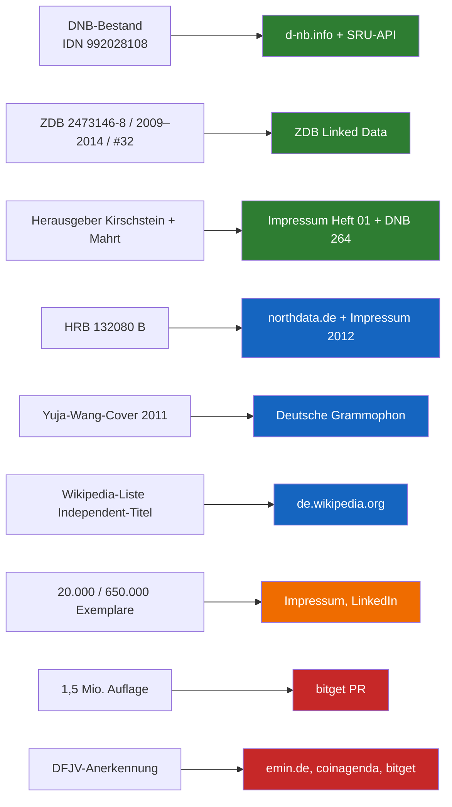

# Recherche: proud magazine Berlin, Emin Mahrt, DFJV, Deutsche Nationalbibliothek

Stand: 2026-10-06. Alle Quellen am 2026-10-06 abgerufen, sofern nicht anders angegeben.
Nur öffentliche Quellen. Nichts erfunden. Maschinenlesbar: `data/input/facts.json`.

Status-Stufen:

- **VERIFIED-PRIMARY**: Institution oder Register selbst (DNB, ZDB, Gesetz), oder das Originalheft.
- **VERIFIED-SECONDARY**: unabhängige Dritte (Label, Blog, Wikipedia, Register-Aggregator).
- **SELF-REPORTED**: Emin, Richard Kirschstein, proud works, LinkedIn, PR-Texte.
- **UNVERIFIED**: keine Quelle gefunden.

## Zusammenfassung

| # | Aussage | Status | Beste Quelle |
|---|---|---|---|
| 1 | proud ist in der Deutschen Nationalbibliothek katalogisiert und vorhanden (Frankfurt + Leipzig, Signatur Z 2009 B 1863, Bestand 2009–6.2014) | VERIFIED-PRIMARY | https://d-nb.info/992028108 |
| 2 | ZDB-ID 2473146-8, OCLC 723868146, monatlich, 2009–2014, eingestellt mit Ausgabe #32 (6. Jahrgang) | VERIFIED-PRIMARY | https://ld.zdb-services.de/data/2473146-8.jsonld |
| 3 | Verlag: Kirschstein & Mahrt GbR → Proud GbR → Proud Works GmbH, Berlin | VERIFIED-PRIMARY | DNB-Datensatz (Feld 264) |
| 4 | Herausgeber Heft 01 (Jan. 2009): Richard Kirschstein und Emin Henri Mahrt | VERIFIED-PRIMARY | Impressum Heft 01, S. 6 (eigenes Archiv) |
| 4a | Herausgeber **heute**: Emin Mahrt; Betreiber des Archivs: Emin Mahrt als Privatperson (keine GmbH). Kirschstein seit Langem ausgeschieden. | SELF-REPORTED (06.10.2026) | Emin, Chat 2026-10-06 |
| 5 | proud works GmbH, Amtsgericht Charlottenburg HRB 132080 B; Gegenstand u. a. „Die Publikation der Proud Magazine“; heute gelöscht | VERIFIED-SECONDARY | northdata.de (Register-Aggregator) |
| 6 | Auflage 20.000 Exemplare pro Heft, kostenlos, werbefinanziert | SELF-REPORTED | proud.de/impressum, Wayback 2012-01-05 |
| 7 | 33 Ausgaben, mehr als 650.000 gedruckte Exemplare, 68 Seiten | SELF-REPORTED | LinkedIn proud works GmbH |
| 8 | „1,5 Millionen Auflage“ | UNVERIFIED / widersprüchlich | nur bitget.com PR-Text |
| 9 | „Vom DFJV anerkannt / ausgezeichnet“ oder „mehrfach erwähnt“ | UNVERIFIED | nur emin.de, coinagenda.com, bitget.com |
| 9a | DFJV-Newsletter „DFJV-News Mai 2009“ (07.05.2009) stellt proud vor: „bunt, aufregend, frisch und eben anders“ | VERIFIED-PRIMARY (Originalmail beim Herausgeber, keine öffentliche URL) | [docs/evidence/DFJV_NEWSLETTER_2009-05.md](evidence/DFJV_NEWSLETTER_2009-05.md) |
| 10 | Unabhängige Erwähnung: Deutsche Grammophon über Yuja-Wang-Cover (06.05.2011) | VERIFIED-SECONDARY | deutschegrammophon.com |

---

## 1. Deutsche Nationalbibliothek (DNB) und ZDB

**Ergebnis: bestätigt.** proud ist in der DNB vorhanden. Der Hinweis „now housed in the German National Library“ stimmt.

### Katalogdaten

| Feld | Wert | Quelle |
|---|---|---|
| Permalink | https://d-nb.info/992028108 | DNB-Portal |
| DNB-IDN | 992028108 | MARC 016 (DE-101) |
| ZDB-ID | 2473146-8 | MARC 016 (DE-600) |
| OCLC | 723868146 | MARC 035 |
| Nationalbibliografie | 09,B33,0430 (Reihe B, Heft 33/2009) | MARC 015 |
| ISSN | **keine** im Datensatz | MARC (kein Feld 022) |
| Titel | Proud | MARC 245 |
| Verlag | Berlin : Proud Works GmbH; anfangs Proud GbR; früher Kirschstein & Mahrt GbR | MARC 264 |
| Erscheinungsjahre | 2009–[2014] | MARC 264 |
| Zählung | „2009 -6. Jahrgang, Ausgabe #32 ; damit Erscheinen eingestellt“ | MARC 362 |
| Frequenz | „Ersch. monatl.“ | MARC 515 |
| Format | 30 cm | MARC 300 |
| Sachgruppe | 740 Grafik, angewandte Kunst (DDC 745.205) | MARC 082/083 |
| Standort Frankfurt | Signatur Z 2009 B 1863, Bestand 2009 – 6.2014 | MARC 924 / Portal |
| Standort Leipzig | Signatur Z 2009 B 1863, Bestand 2009 – 6.2014 | MARC 924 / Portal |

Portal-Text (wörtlich): „Frankfurt Signatur: Z 2009 B 1863 Bestand: 2009 - 6.2014 Bereitstellung in Frankfurt / Leipzig Signatur: Z 2009 B 1863 Bestand: 2009 - 6.2014 Bereitstellung in Leipzig“.

Quellen:

- Portal: https://portal.dnb.de/opac.htm?method=simpleSearch&cqlMode=true&query=idn%3D992028108
- SRU (MARC): https://services.dnb.de/sru/dnb?version=1.1&operation=searchRetrieve&recordSchema=MARC21-xml&query=vlg%3D%22proud%20works%22
- SRU ZDB mit Bestand (Feld 924): https://services.dnb.de/sru/zdb?version=1.1&operation=searchRetrieve&recordSchema=MARC21plus-1-xml&query=zdbid%3D2473146-8
- ZDB Linked Data: https://ld.zdb-services.de/data/2473146-8.jsonld („issued 2009-2014“, publisher „Proud Works GmbH“, accrualPeriodicity „mon“)

### Gesucht, aber nicht gefunden

- `tit=proud magazine` → 0 Treffer. `tit=proud and tit=magazin` → 1 fremder Treffer. Der Titel lautet nur „Proud“.
- `per=Mahrt` → 242 Treffer, keiner zu proud. Emin Mahrt ist **nicht** als Person verknüpft.
- Keine GND-Person „Emin Mahrt“ gefunden. Keine ISSN.
- zdb-katalog.de und lobid.org blockieren Skripte (Anubis-Schutz). Daten kamen über SRU und ld.zdb-services.de.

### Einordnung (Pflichtexemplar)

Die DNB sammelt Druckwerke deutscher Verlage als Pflichtexemplar. § 14 Abs. 1 DNBG: „Die Ablieferungspflichtigen haben Medienwerke in körperlicher Form … in zweifacher Ausfertigung … abzuliefern.“ Quelle: https://www.gesetze-im-internet.de/dnbg/__14.html

Das heißt: Die DNB-Aufnahme beweist, dass proud ein regulär erschienenes, abgeliefertes Periodikum ist. Sie ist **keine Auszeichnung** und keine inhaltliche Bewertung. Formulieren als „archiviert in der DNB“, nicht als „von der DNB aufgenommen wegen Bedeutung“.

Offen: Bestand „2009 – 6.2014“ ist eine Spanne. Ob jedes Heft vollständig vorhanden ist, zeigt der Katalog nicht. Bei der DNB nachfragen.

---

## 2. DFJV (Deutscher Fachjournalisten-Verband)

**Ergebnis (Update 06.10.2026):** Eine Erwähnung ist belegt: Newsletter „DFJV-News Mai 2009“ (07.05.2009), Abschnitt „Proud Magazine“, Originalmail beim Herausgeber, siehe [Beleg](evidence/DFJV_NEWSLETTER_2009-05.md). „Anerkannt“, „ausgezeichnet“ oder „mehrfach erwähnt“ bleibt **unbelegt**. Keine öffentliche DFJV-Quelle online.

### Was gesucht wurde

| Suche | Ergebnis |
|---|---|
| `site:dfjv.de proud`, `site:dfjv.de Mahrt` (Websuche) | nur allgemeine DFJV-Seiten |
| https://www.dfjv.de/suche?q=proud und ?q=Mahrt (Browser) | Seite „Seite nicht gefunden …“, Suche öffentlich nicht nutzbar |
| Wayback CDX dfjv.de mit „proud“ oder „mahrt“ in der URL | 0 Treffer |
| `fachjournalist.de proud`, `"DFJV" "proud magazine"` | keine Treffer |
| Wayback CDX proudmagazine.de/proud.de mit dfjv/journalist/preis | keine DFJV-Seite; nur Werbe-Pressemitteilungen |
| Eigenes Repo (`*.md`) nach dfjv/Fachjournalist/Presseausweis | 0 Treffer |

### Wo die Behauptung herkommt (alle SELF-REPORTED)

- https://emin.de (Weiterleitung auf emin.carrd.co): „an independent socio-political publication recognized by the DFJV and archived in the German National Library“. Der DFJV-Link zeigt nur auf https://www.dfjv.de (Startseite).
- https://coinagenda.com/emin-henri-mahrt: „Proud magazine has been noted by the German Journalist Association multiple times.“
- https://bitget.com/news/detail/12560604619656: „acknowledged by the Association of German Journalists (DFJV) for its cultural influence“.

Achtung: „Association of German Journalists“ wäre eher der **DJV** (Deutscher Journalisten-Verband), nicht der DFJV. Die Quellen sind hier unklar.

### Was Emin beim DFJV erfragen sollte (schriftlich)

1. Gab es eine Erwähnung von proud (Fachjournalist, Newsletter, Pressemitteilung, Preis, Liste)? Datum und Fundstelle.
2. Waren Emin Mahrt oder Richard Kirschstein Mitglied? Zeitraum. Mitgliedsnummer.
3. Wurde ein DFJV-Presseausweis ausgestellt? Für welche Jahre?
4. Bitte um eine kurze schriftliche Bestätigung auf DFJV-Briefkopf (PDF), die wir zitieren dürfen.

Kontakt laut DFJV-Seite: kontakt@dfjv.de, +49 30 81003688-0, Karmeliterweg 84, 13465 Berlin.

---

## 3. proud magazine: Geschichte

### Gründung, Verlag, Leute

| Aussage | Status | Quelle (Zitat) |
|---|---|---|
| Heft 01 erschien Januar 2009 | VERIFIED-PRIMARY | Issuu: „#01 proud magazine Berlin“ `/proud/docs/01-proud-magazine-berlin-januar-2009`, https://issuu.com/proud; DNB „2009-“ |
| Es gab ein Heft #00 (Dummy, 2008) | VERIFIED-PRIMARY (Original) | Issuu „#00 proud magazine Berlin (dummy)“ `/proud/docs/00-proud-magazine-berlin-dummy-2008`; OCR `data/output/ocr/00-proud-issuu-output/pages/page-004.md` „Willkommen zu der Startausgabe des proud magazine“ |
| Publisher Heft 01: Richard Kirschstein, Emin Henri Mahrt | VERIFIED-PRIMARY (Heft) | Impressum Heft 01, S. 6: „Publisher Richard Kirschstein Emin Henri Mahrt“ (`data/output/ocr/01-proud-issuu-output/pages/page-006.md`) |
| Weitere Redaktion Heft 01 | VERIFIED-PRIMARY (Heft) | „Text Editor Miron Tenenberg“, „Fashion Editor Emilie Wong“, „Event Manager Rico Kramer“, „Cover Jason Forster“ |
| Verlagsadresse Heft 01: proud GbR, Manteuffelstraße 64, 10999 Berlin Kreuzberg | VERIFIED-PRIMARY (Heft) | Impressum Heft 01, S. 6 |
| Adresse Heft 00: proud GbR, Naunynstraße 27, 10997 Berlin | VERIFIED-PRIMARY (Heft) | OCR Heft 00, S. 4 und S. 35 („proud GbR Emin Mahrt & Richard Kirschstein Naunynstraße 27 10997 Berlin“) |
| Selbstbeschreibung: „freie, monatliche Publikation“ | VERIFIED-PRIMARY (Heft) | Impressum Heft 01 |
| Verlagsfolge Kirschstein & Mahrt GbR → Proud GbR → Proud Works GmbH | VERIFIED-PRIMARY | DNB MARC 264 |
| V.i.S.d.P. Emin Mahrt oder Richard (2010) | SELF-REPORTED | Wayback 2010-08-29: „Verantwortlicher im Sinne des Presserechts ist Emin Mahrt oder Richard.“ http://web.archive.org/web/20100829175147/http://proudmagazine.de:80/about |
| Geschäftsführer der GmbH: Richard Kirschstein, Emin Mahrt; HRB 132080 B; USt-ID DE276341504 | SELF-REPORTED | Impressum 2012: http://web.archive.org/web/20120105062932/http://proud.de/impressum |
| proud works GmbH, AG Charlottenburg HRB 132080 B, EUID DEF1103R.HRB132080B, Gegenstand „Die Publikation der Proud Magazine, die Produktion von Werbung, Musik, Film und Mode …“; gelöscht (✝) | VERIFIED-SECONDARY | https://www.northdata.de/proud%20works%20GmbH,%20Berlin/Amtsgericht%20Charlottenburg%20(Berlin)%20HRB%20132080%20B |
| GmbH gegründet 08.02.2011 | VERIFIED-SECONDARY (schwach) | Tracxn: „incorporated on Feb 08, 2011“ https://tracxn.com/d/legal-entities/germany/proud-works-gmbh/__P0DLA-QBIEwd8JmBcq0izQCvuCYxLK6N_Dcnfv6qRNc |
| Mitgründer Kirschstein: Start „Anfang 2009 gemeinsam mit meinem Geschäftspartner Emin Mahrt“ | SELF-REPORTED | https://about.me/richard_kirschstein |

Widersprüche beim Gründungsjahr: LinkedIn proud works „Founded in 2008“; Impressum 2012 „erscheint seit Dezember 2008“; Kirschstein „Anfang 2009“; DNB „2009“; Kirschsteins LinkedIn „March 2006 – September 2013“. **Sicher sagen:** erstes reguläres Heft Januar 2009, Dummy-Heft 2008.

### Auflage, Umfang, Vertrieb

| Aussage | Status | Quelle (Zitat) |
|---|---|---|
| 20.000 Exemplare pro Heft, kostenlos | SELF-REPORTED | Impressum 2012: „proud magazine erscheint seit Dezember 2008 in einer Auflage von 20.000 Magazinen.“ „ist und bleibt proud 100% kostenfrei“ |
| Vertrieb über Auslageorte in Berlin, PDF, iPad-App, Gratis-Abo ab Mai 2011 | SELF-REPORTED | dito, „Liste der Auslageorte“, „seit Mai 2011 ein kostenfreies Magazin Abo“ |
| 33 Ausgaben, mehr als 650.000 Exemplare, Offset, 68 Seiten | SELF-REPORTED | https://linkedin.com/company/proud-works: „33 Issues, printed and distributed with a total number of more than 650.000 copies (high quality offset print, 68 pages)“ |
| Heft 01 hat 68 Seiten | VERIFIED-PRIMARY (Heft) | `data/output/library.json`: `"pageCount": 68` |
| Mehr als 650.000 Exemplare | SELF-REPORTED | coinagenda.com: „printed over 650,000 copies“ |
| 1,5 Mio. Auflage | UNVERIFIED, widerspricht den anderen Angaben | bitget.com: „total circulation of 1.5 million copies“ |
| Keine IVW-Prüfung gefunden | — | Kein Treffer; Auflage ist nicht unabhängig geprüft |

Plausibilität: 32 nummerierte Hefte + Dummy = 33. 33 × 20.000 = 660.000. Das passt zu „mehr als 650.000“. Die 1,5 Mio. passen nicht.

### Ende

- DNB: „Ausgabe #32 ; damit Erscheinen eingestellt“, 6. Jahrgang, 2014. VERIFIED-PRIMARY.
- Issuu: #32 hochgeladen am 27.02.2014. VERIFIED-PRIMARY (Konto des Verlags).
- Grund für das Ende: **keine Quelle.** Kirschstein schreibt, proud habe sich zur Agentur entwickelt („Verlag über eine Kommunikations- und Eventagentur zu einem umfassenden Medienunternehmen“, https://www.eventinc.de/event-dienstleister/berlin/proud-works). SELF-REPORTED.

### Bekannte Inhalte und Dritt-Erwähnungen

| Inhalt / Erwähnung | Status | Quelle (Zitat) |
|---|---|---|
| Cover und Fotostrecke mit Pianistin Yuja Wang (2011) | VERIFIED-SECONDARY | Deutsche Grammophon, 06.05.2011: „Bei ihrem letzten Berlinaufenthalt konnte das Magazin proud die junge Starpianistin Yuja Wang spontan zu einem Fashion Shooting gewinnen … zeigen das Cover der neuen Ausgabe des proud Magazins“ https://www.deutschegrammophon.com/de/kuenstler-innen/yujawang/neuigkeiten/yuja-wang-im-proud-magazin-183961 |
| Text „The Day Street Art Died“ (Lukas Kampfmann, Heft 15, April 2010) nachgedruckt | VERIFIED-SECONDARY | ilovegraffiti.de, 13.04.2010: „Den durchaus interessanten Text haben wir in der aktuellen Proud gefunden.“ https://ilovegraffiti.de/blog/2010/04/13/the-day-street-art-died/ |
| Interview „A Bottle Of Held Vodka With A Guy Called Gerald“, Heft 15, S. 28 (Lev Nordstrom, Fotos Richard Kirschstein) | VERIFIED-SECONDARY | Fan-Seite: http://homepages.force9.net/king1/Media/Articles/2010-04-Proud-Article.htm |
| Interview mit SoundCloud-Gründer Eric Wahlforss (Emin Mahrt, 02.02.2009) als Beleg in Wikipedia | VERIFIED-SECONDARY | de.wikipedia.org/wiki/SoundCloud, Einzelnachweis: „Emin Mahrt: proud magazine. In: proud.de. proud works GmbH, 2. Februar 2009“ https://de.wikipedia.org/wiki/SoundCloud |
| proud in Wikipedia-Liste „Independent-Titel“ | VERIFIED-SECONDARY (Wikipedia ist offen editierbar) | „proud magazine (Berlin-Lifestyle, Fashion, Art und Music)“ https://de.wikipedia.org/wiki/Independent-Titel |
| Künstler Boris Petrovsky nennt Interview in „Proud Magazin, Berlin“ | VERIFIED-SECONDARY | https://www.abtart.de/ausstellungen/archiv/detail/1426/kuenstler/1454.html |
| Partyreihe „Proud Magazin presents Easter Bash“, Cookies Berlin, 07.04.2012 | VERIFIED-SECONDARY | https://www.gaesteliste030.de/en/berlin/events/party/07-04-12/proud-magazin-presents-easter-bash |
| Werbekunden Carlsberg, Bacardi, Mercedes Benz u. a. | SELF-REPORTED | LinkedIn proud works GmbH |
| Event-Agentur, „über 100.000 Eventgäste“ | SELF-REPORTED | eventinc.de |

**Nicht gefunden:** Berichte in Tip Berlin, Zitty, Spiegel, taz, Tagesspiegel, Berliner Zeitung, Vice, Groove, Juice. Kein Wikidata-Eintrag („proud magazine“: 0 Treffer; „Emin Mahrt“: 0 Treffer, wbsearchentities). Keine Preise gefunden.

### Profile

- Issuu: https://issuu.com/proud („proud magazine Berlin … Independent Berlin Magazine“), 33 Uploads #00–#32 (Teile doppelt).
- LinkedIn: https://linkedin.com/company/proud-works , https://linkedin.com/company/proud-magazine
- Alte Websites (Wayback): http://web.archive.org/web/2010*/proudmagazine.de , http://web.archive.org/web/2012*/proud.de

---

## 4. Emin Mahrt: öffentliche Biografie

### Relevant für die Presse-Seite (Verlegerrolle)

| Aussage | Status | Quelle |
|---|---|---|
| Mitherausgeber („Publisher“) von proud ab Heft 01 | VERIFIED-PRIMARY (Heft) | Impressum Heft 01 |
| Verlagsname „Kirschstein & Mahrt GbR“ | VERIFIED-PRIMARY | DNB MARC 264 |
| Geschäftsführer proud works GmbH | SELF-REPORTED | Impressum 2012 (Wayback) |
| Verantwortlich im Sinne des Presserechts (mit Richard) | SELF-REPORTED | proudmagazine.de/about 2010 (Wayback) |
| Autor eines Interviews mit Eric Wahlforss (SoundCloud), 2009 | VERIFIED-SECONDARY | Wikipedia-Einzelnachweis SoundCloud |
| LinkedIn: „Co-Founder at proud works GmbH, January 2008 – December 2015“ | SELF-REPORTED | https://linkedin.com/in/bitcoinlightning |

### Spätere Laufbahn (getrennt halten, nicht für Presseakkreditierung nötig)

| Aussage | Status | Quelle |
|---|---|---|
| Vorstand (Board Member) æternity crypto foundation, 2019 zitiert | VERIFIED-SECONDARY | EIN Presswire: „said Emin Mahrt, Board Member of the æternity crypto foundation“ https://einpresswire.com/article/505264063/ternity-crypto-foundation-joins-erlang-ecosystem-foundation-as-founding-member |
| Speaker æternity Universe One (Produkt- und Betriebsmanager) | VERIFIED-SECONDARY | https://icoholder.com/ko/events/aeternity-universe-one-conference-26180 |
| Nuri: „founded and run by Emin Mahrt“, Nurisoft Development OÜ, Tallinn | SELF-REPORTED | https://nuri.com/about |
| CPO Börse Stuttgart Digital Exchange 10/2021–10/2022 | SELF-REPORTED | LinkedIn |
| Mitgründer Abend (2014) | SELF-REPORTED | https://gust.com/companies/abend |
| GitHub eminogrande, Beiträge zu aeternity/web-dev | VERIFIED-PRIMARY (GitHub) | https://github.com/eminogrande |
| IT- und Politikstudium, zwei Jahre Hongkong | SELF-REPORTED | bitget.com. Teilstütze: Editorial Heft 01 ist datiert „Hong Kong, Peng Chau, den 25.08.2007“ (VERIFIED-PRIMARY, Heft) |
| „Dropspot“ mit Förderung von Axel Springer (2012) | SELF-REPORTED | coinagenda.com, bitget.com |

Hinweis: Die Texte auf bitget.com und bitcoinethereumnews.com sind fast wortgleich. Sie lesen sich wie ein eingereichter PR-Text. Nicht als unabhängige Presse zitieren.

---

## Offene Fragen an Emin

1. DFJV: Gibt es ein Schreiben, eine Mitgliedschaft, einen Presseausweis, eine Erwähnung im „Fachjournalist“? Bitte Dokument oder Datum.
2. Woher stammen die 1,5 Mio. im bitget-Text? Sonst überall 650.000. Sollen wir 1,5 Mio. aktiv korrigieren?
3. Druckauflage pro Heft: Gibt es Druckereirechnungen oder Mediadaten (PDF) mit Auflage?
4. Gründung: Dummy 2008 oder Heft 01 Januar 2009 als Startdatum? (Kirschsteins LinkedIn sagt 2006.)
5. Wann genau wurde die GmbH gelöscht? Handelsregister-Auszug (HRB 132080 B) als PDF beschaffen.
6. Gibt es Presseartikel über proud (Tip, Zitty, taz …) im eigenen Archiv? Bitte Scan oder Link.
7. ~~Darf Richard Kirschstein als Mitgründer genannt werden?~~ Geklärt 06.10.2026: Kirschstein bleibt als Herausgeber von Heft 01 (wie gedruckt) genannt; heutiger Herausgeber ist allein Emin Mahrt.
8. DNB: Sind alle 32 Hefte vollständig? Bestätigung bei der DNB (Zeitschriftenstelle) anfragen.

## Was wir auf der About-Seite sicher sagen können

Nur VERIFIED-PRIMARY oder VERIFIED-SECONDARY.

**Deutsch**

- proud war ein unabhängiges Berliner Monatsmagazin. Es erschien von 2009 bis 2014 in 32 Ausgaben.
- Herausgeber heute: Emin Mahrt (Angabe des Herausgebers, 06.10.2026). Er betreibt das Archiv als Privatperson.
- Heft 01 (2009): Herausgeber laut Impressum Richard Kirschstein und Emin Henri Mahrt.
- Laut Katalog der DNB erschien das Heft früher bei der Kirschstein & Mahrt GbR, der Proud GbR und der Proud Works GmbH (nur als Geschichte, nie als heutiger Betreiber).
- Das Magazin ist in der Deutschen Nationalbibliothek in Frankfurt am Main und Leipzig archiviert (Signatur Z 2009 B 1863, ZDB-ID 2473146-8).
- Die Deutsche Grammophon berichtete 2011 über das proud-Cover mit der Pianistin Yuja Wang.
- Die deutschsprachige Wikipedia zitiert ein proud-Interview mit SoundCloud-Gründer Eric Wahlforss aus dem Jahr 2009.

**English**

- proud was an independent monthly magazine from Berlin. It ran from 2009 to 2014 and published 32 issues.
- Publisher today: Emin Mahrt (owner statement, 6 Oct 2026). He runs the archive as a private person.
- Issue 01 (2009): publishers according to the masthead, Richard Kirschstein and Emin Henri Mahrt.
- According to the DNB catalogue, earlier publishing entities were Kirschstein & Mahrt GbR, Proud GbR and Proud Works GmbH (history only, never the current operator).
- The magazine is archived at the German National Library in Frankfurt am Main and Leipzig (shelf mark Z 2009 B 1863, ZDB ID 2473146-8).
- Deutsche Grammophon reported on proud's 2011 cover with pianist Yuja Wang.
- German Wikipedia cites a 2009 proud interview with SoundCloud co-founder Eric Wahlforss.

Optional, klar als Eigenangabe markiert: „Nach Verlagsangaben erschien proud in einer Auflage von 20.000 Exemplaren pro Ausgabe.“ / „According to the publisher, each issue had a print run of 20,000 copies.“

Hinweis: Der DNB-Bestand lautet „2009 – 6.2014“. „Alle Ausgaben“ erst nach Bestätigung durch die DNB schreiben.

## Was wir NICHT behaupten sollten (noch nicht)

- „Vom DFJV anerkannt / ausgezeichnet / geehrt.“ Keine Quelle.
- „1,5 Millionen Auflage.“ Widerspricht eigenen Angaben.
- „Mehr als 650.000 Exemplare“ ohne den Zusatz „nach Verlagsangaben“.
- „Eines der letzten unabhängigen deutschen Magazine.“ Werbesprache, nicht belegbar.
- „Von der DNB wegen kultureller Bedeutung aufgenommen.“ Es ist eine gesetzliche Pflichtablieferung.
- „Gegründet 2006“ oder „2008“ als Erscheinungsbeginn. Belegt ist Januar 2009 (Dummy 2008).
- Berichte in Tip, Zitty, taz, Spiegel usw. Nichts gefunden.
- Eine ISSN. Es gibt keine im Katalog.
- „Emin Mahrt war 2009 alleiniger Herausgeber.“ Falsch: Heft 01 nennt zwei Herausgeber. Richtig: „Herausgeber heute: Emin Mahrt“ und „Heft 01 (2009): Herausgeber laut Impressum Richard Kirschstein und Emin Henri Mahrt“.
- proud works GmbH (oder eine andere Gesellschaft) als heutigen Betreiber oder Verlag nennen. Betreiber ist Emin Mahrt als Privatperson.
