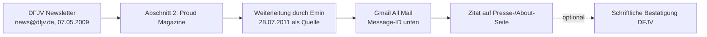

# Beleg: DFJV-Newsletter Mai 2009 über proud

Status: **VERIFIED, Originalmail im Postfach des Herausgebers.** Keine öffentliche Online-Kopie gefunden (dfjv.de-Suche, Web-Archiv: 429/leer, Websuche: kein Treffer). Für eine öffentliche Zitierung beim DFJV eine schriftliche Bestätigung anfordern.

## Metadaten (ohne private Adressen)

| Feld | Wert |
|---|---|
| Absender | News@dfjv.de (Deutscher Fachjournalisten-Verband) |
| Titel | DFJV-News Mai 2009 (Betreff: "DFJV Mai-Newsletter") |
| Datum | 07.05.2009 |
| Abschnitt | 2. "Proud Magazine" (Themenliste Nr. 2 der Ausgabe) |
| Fundstelle | Gmail "[Google Mail]/All Mail", Weiterleitung "Fwd: DFJV Mai-Newsletter" vom 28.07.2011 01:13 +0200 |
| Message-ID der Weiterleitung | `CAPCYg-eXpUY4H6+MAhHY5Gw0NA7_zYzM9weqSnnctCryP+JpLA@mail.gmail.com` |
| Lokale Kopie (nicht im Repo, enthält Adressdaten) | `~/.hermes/cache/scratch/dfjv_166732.txt` |

## Wortlaut des Abschnitts (Originalschreibweise)

> **2. Proud Magazine**
>
> Was liest die Geschäftsstelle des DFJV privat eigentlich so? Seit kurzem zum Beispiel das proud magazine – ins Leben gerufen von jungen Nachwuchsjournalisten.
>
> In schwierigen Zeiten versucht das neue Berliner Redaktionsteam mit Kreativität und Individualität zu punkten.
>
> Das monatlich erscheinende Magazin ist aber vor allem eins: von Berlinern für Berliner. Und das bedeutet **bunt**, aufregend, frisch und eben anders.
>
> Und damit alle etwas davon haben, gibt es das Magazin kostenfrei in vielen Berliner Läden.
>
> Wenn Sie sich ein eigenes Bild machen möchten, schauen Sie doch einfach mal auf der Homepage http://proudmagazine.de/ vorbei. Dort können Sie auch einen Blick in die bereits veröffentlichten Magazine werfen – interessant auch für alle Nicht-Berliner.

## Was die Quelle belegt und was nicht

| Aussage | Belegt? |
|---|---|
| Der DFJV stellte proud im Mai-Newsletter 2009 positiv vor ("bunt, aufregend, frisch und eben anders") | Ja |
| Die DFJV-Geschäftsstelle las proud privat | Ja, so formuliert |
| proud war damals kostenlos, monatlich, in vielen Berliner Läden | Ja, laut DFJV |
| Der DFJV hat proud "ausgezeichnet" oder "anerkannt" | **Nein.** Kein Beleg. Nicht behaupten. |
| "mehrfach vom DFJV erwähnt" (coinagenda) | Nur 1 Newsletter belegt. Weitere Erwähnungen suchen. |

## Sichere Formulierung für die Seite

DE: "Der Deutsche Fachjournalisten-Verband stellte proud im Newsletter DFJV-News vom 7. Mai 2009 vor: 'bunt, aufregend, frisch und eben anders.'"

EN: "The German professional journalists' association DFJV featured proud in its newsletter DFJV-News of 7 May 2009: 'bunt, aufregend, frisch und eben anders' (colourful, exciting, fresh and simply different)."
